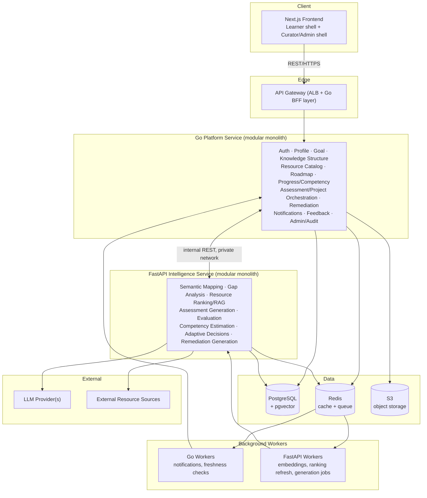
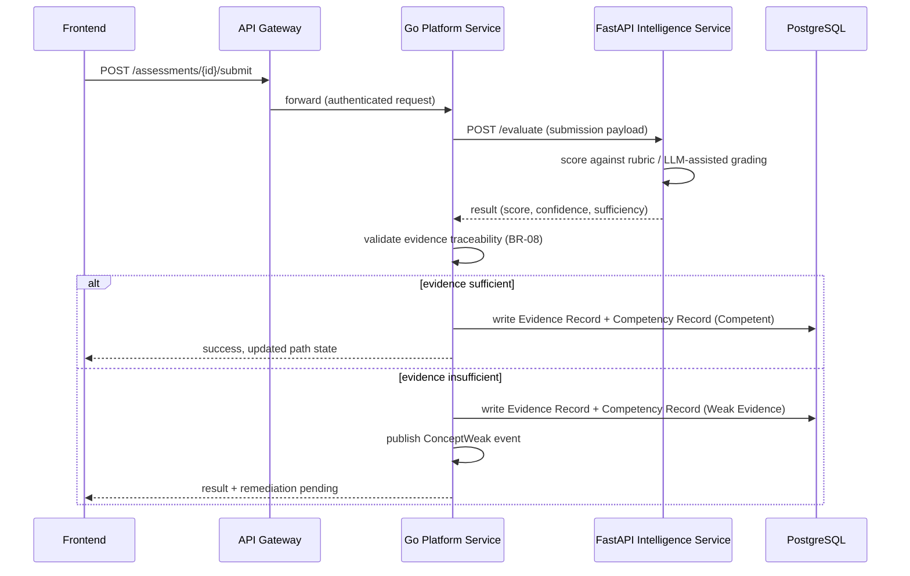
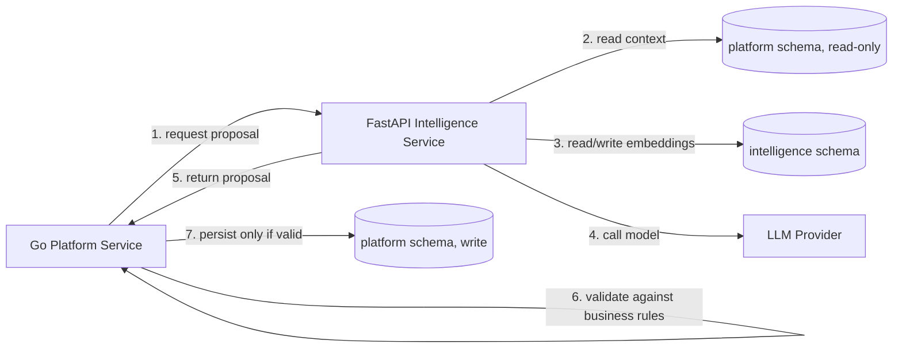
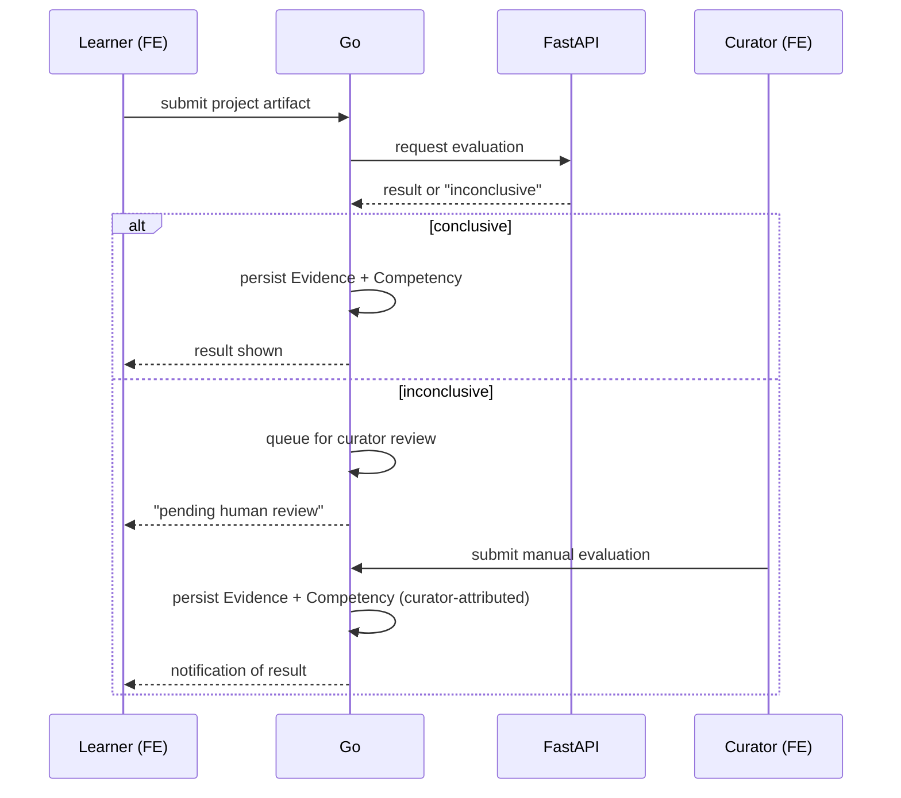
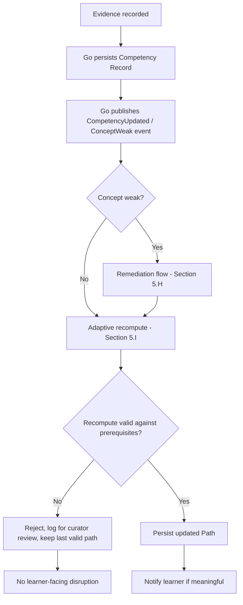
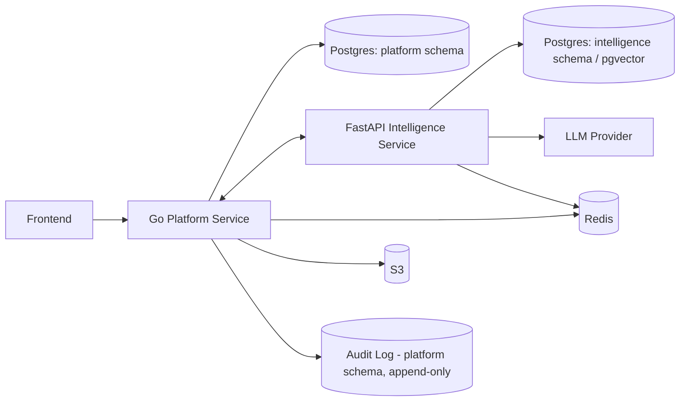

# Technical Architecture
## AI-Powered Personalized Learning Platform

*Built strictly on the approved Product Blueprint, SRS, and UX Design. Business logic drives this architecture, not the reverse. Stack: Next.js/React/TypeScript · Go · FastAPI/Python · PostgreSQL + pgvector · Redis · Docker · AWS.*

---

## 1. Architectural Principles

**Separation of concerns:** The system splits along a single, consistent line — *deterministic, rule-enforcing business logic* vs. *probabilistic, AI-assisted computation* — rather than by feature area. This maps directly onto the language boundary already implied by the stack (Go for the former, FastAPI/Python for the latter), so the architecture doesn't need to invent an artificial service boundary; it formalizes one the stack already implies.

**Service ownership:** Two logical services at MVP — the **Go Platform Service** and the **FastAPI Intelligence Service** — each internally organized as a modular monolith (clear internal module boundaries, single deployable unit), not split into microservices per SRS capability.

**Data ownership:** The Go Platform Service is the **single writer** for all core business entities (learners, goals, knowledge structures, resources, competency records, evidence, paths, audit log). The FastAPI Intelligence Service **never writes business entities directly** — it computes and returns proposals; Go validates and persists. FastAPI owns only ML-derived artifacts (embeddings, cached model scratch data) in a separate schema.

**AI boundaries (the core rule of this architecture):** *FastAPI proposes, Go disposes.* Every AI/ML output — a suggested path, a ranked resource, a generated assessment item, a competency estimate, a remediation suggestion — is a **proposal**. It only becomes real system state after Go validates it against the deterministic business rules from the SRS (BR-01 through BR-12) and persists it. This is what makes BR-02 ("no component may freely invent or alter prerequisite relationships") and BR-06 ("competency only from evidence") structurally enforceable rather than just documented.

**Deterministic vs. probabilistic responsibilities:**
- Deterministic (Go): identity/access, prerequisite-graph integrity, evidence traceability, competency state transitions, business-rule enforcement, audit logging.
- Probabilistic (FastAPI): semantic goal mapping, gap prioritization, resource ranking, assessment generation, evaluation/grading, competency estimation from evidence, adaptive sequencing suggestions, remediation content generation.

**Synchronous vs. asynchronous operations:** Anything on the learner's critical path that must feel immediate (submit an assessment, view the roadmap, log in) is synchronous with a bounded timeout. Anything computationally heavy or non-blocking by nature (resource discovery/ranking refresh, embedding generation, notification dispatch, freshness re-checks, batch adaptive recomputation) is asynchronous via the Redis-backed queue and background workers.

**Reliability boundaries:** The Go service is the reliability boundary for business-critical state — it fails closed (rejects the write) rather than risk corrupting competency/evidence data, per the SRS Data Integrity NFR. The FastAPI service is allowed to degrade (return a lower-confidence or cached result, or fail and trigger a documented fallback) without taking down the platform, because none of its outputs are authoritative until Go validates them.

**Security boundaries:** The FastAPI service and all external AI/resource providers are **never exposed to the public internet or the frontend directly** — only the Go Platform Service is reachable through the API Gateway. This keeps LLM provider credentials, prompts, and raw AI I/O entirely inside a private boundary.

---

## 2. Logical Architecture

### 2.1 MVP Architectural Style: Two-Service Modular Monolith

**Decision:** Modular monolith (×2 — one per language boundary), **not** microservices, **not** a single shared-language monolith.

**Why not a single monolith:** The stack already requires two runtimes (Go for platform logic, Python/FastAPI for AI/ML) — Python's ML/LLM ecosystem is the reason FastAPI exists in the stack at all, and Go is the reasonable choice for the deterministic, concurrency-heavy platform logic. Forcing both into one language would fight the stack, not simplify it.

**Why not microservices:** Splitting Authentication, Learner Profile, Roadmap, Progress, Notifications, etc. into separate deployable services at MVP would multiply operational overhead (12+ services, 12+ deployment pipelines, network calls where in-process calls would do) without a scaling or team-ownership reason to justify it yet. The SRS's own functional-requirement groupings (Section 3, FR-AUTH through FR-ADMIN) become **internal modules** inside the Go service instead of separate services — same logical separation, none of the distributed-systems cost. The same applies to FastAPI's internal capabilities (semantic mapping, ranking, generation, evaluation, estimation, adaptation, remediation).

**When to reconsider:** Section 12 (Production Evolution) defines the specific triggers under which individual modules would be extracted into standalone services.

### 2.2 Components

### 2.3 Component Notes

- **Frontend (Next.js):** A single application with two role-gated route groups (Learner shell, Curator/Admin shell) sharing a component library, matching the UX design's requirement that the two experiences never visually blend while avoiding two separate deployments at MVP.
- **API Gateway / BFF:** Public entry point (AWS ALB in front of the Go service, which itself acts as the Backend-for-Frontend). Handles TLS termination, rate limiting, and routes authenticated traffic into Go. FastAPI is **not** reachable from here.
- **PostgreSQL + pgvector:** Single database instance at MVP, with a clear **schema-level ownership split**: a `platform` schema owned and written only by Go (all business entities from Section 9), and an `intelligence` schema owned and written only by FastAPI (resource/goal embeddings and other ML-derived artifacts). FastAPI has scoped read access to the specific `platform` tables it needs for context (e.g., published resources, knowledge structure) but never writes there.
- **Redis:** Shared instance at MVP, partitioned by key prefix/queue name into Go-owned queues (notifications, freshness checks) and FastAPI-owned queues (embedding generation, ranking refresh, assessment/remediation generation jobs), plus session/rate-limit cache for Go.
- **Object storage (S3):** Stores learner project-submission artifacts and any curator-uploaded resource metadata assets.
- **External resource sources / LLM providers:** Reached exclusively from FastAPI, never from Go or the frontend.

---

## 3. Service Responsibilities

### 3.1 Go Platform Service (owns all persisted state; deterministic/rule-enforcing)

| Module | SRS Traceability | Responsibility |
|---|---|---|
| Auth & Session | FR-AUTH-01, FR-AUTH-02 | Registration, login, session/token lifecycle |
| User & Role Management | FR-ADMIN-01 | Accounts, role assignment (Learner/Curator/Admin) |
| Learner Profile | FR-PROF-01 | Constraints, preferences, declared experience |
| Goal Management | FR-GOAL-01 | Goal capture, mapping confirmation, revision |
| Knowledge Structure (source of truth) | FR-EXPERT-01 | Stores concepts/prerequisites; enforces graph validity (no circular/invalid dependencies) — the hard-constraint check lives here, not in FastAPI, because it is a deterministic integrity rule, not a judgment call |
| Resource Catalog | FR-DISC-01, FR-CUR-01 | Resource metadata, provenance, publish/retire state, freshness status |
| Roadmap Orchestrator | FR-PATH-01, FR-ADAPT-01 | Owns the Path entity; requests gap/ranking/adaptation proposals from FastAPI, validates against prerequisite constraints and published-resource availability, persists the result |
| Progress & Competency Record | FR-SKILL-01, FR-COMP-01, FR-PROG-01 | Source of truth for competency state; accepts updates only with a traceable evidence reference (BR-08) |
| Assessment/Project Orchestrator | FR-QUIZ-01, FR-PROJ-01 | Delivers assessments, collects submissions, calls FastAPI for generation/evaluation, persists results |
| Remediation Orchestrator | FR-REM-01 | Inserts targeted remediation steps based on FastAPI's remediation proposal, enforces "specific weak concept only" rule |
| Notifications | FR-NOTIF-01 | Event-triggered learner notifications |
| Feedback | FR-FDBK-01 | Captures and aggregates resource/path feedback |
| Admin/Audit | FR-ADMIN-01, BR-12 | Attributable logging of all curator/admin actions and competency-affecting events |
| API Orchestration (BFF) | — | Shapes responses for each frontend screen (P-01–P-18) |

### 3.2 FastAPI Intelligence Service (stateless proposals; probabilistic/ML)

| Module | SRS Traceability | Responsibility |
|---|---|---|
| Goal/Skill Semantic Mapping | FR-GOAL-01 (support) | Maps free-text goal input to candidate knowledge structures for Go to confirm |
| Skill-Gap Analysis | FR-GAP-01 (support) | Computes/prioritizes concept gaps given competency record + knowledge structure, returned as a proposal |
| Resource Ranking / RAG | FR-PATH-01 (support), FR-DISC-01 (support) | Ranks published, provenance-complete candidate resources per concept and learner preference |
| Assessment Generation | FR-QUIZ-01 (support) | Generates/selects assessment items per concept |
| Evaluation Engine | FR-QUIZ-01, FR-PROJ-01 (support) | Scores learner submissions; returns a confidence-qualified result; low-confidence results are flagged for curator review, never forced to pass/fail |
| Competency Estimation | FR-DIAG-01 (support), FR-COMP-01 (support) | Estimates competency from diagnostic/assessment/project evidence |
| Adaptive Decision Logic | FR-ADAPT-01 (support) | Proposes path resequencing when new evidence arrives |
| Remediation Generation | FR-REM-01 (support) | Proposes a resource/approach targeted at the specific weak concept |

**No duplication rule:** Anything FastAPI proposes, Go is the only one that persists — there is no entity or table that both services write to. Anything that is a hard constraint (prerequisite graph validity, evidence traceability, business-rule compliance) is checked in Go, even if the *suggestion* that triggered the check came from FastAPI.

---

## 4. Communication Model

| Path | Protocol | Why | Payload | Frequency | Failure Handling | Retry Strategy |
|---|---|---|---|---|---|---|
| Frontend → API Gateway → Go | REST over HTTPS/JSON | Simple, cacheable, matches page/screen-oriented UX (P-01–P-18) | Screen-scoped request/response DTOs | High (every learner interaction) | Standard HTTP error responses; frontend shows the error states defined per page in the UX doc | Idempotent GETs retried by client; mutating calls not auto-retried, user-initiated retry only |
| Frontend → Go | SSE (server-sent events) or short-poll for notifications | Lightweight real-time-ish updates without the operational cost of WebSocket infra at MVP | Notification event payloads | Low–medium | Falls back to poll-on-load if stream drops | Reconnect with backoff |
| Go → FastAPI | Internal REST/JSON, private network only | Simplicity and debuggability across a two-language, mixed-familiarity team at MVP; payloads are not so latency-critical that gRPC's complexity is justified yet | Structured proposal request/response (e.g., gap list, ranked resources, evaluation result) | Medium–high (roadmap generation, assessment evaluation, adaptive recompute) | Circuit breaker (Section 8); on failure, Go falls back to last valid persisted state, never blocks the learner indefinitely | Bounded retries with backoff on idempotent read-style calls only; evaluation calls carry an idempotency key |
| Go ↔ Redis (queue) | Redis protocol | Decouples heavy/non-blocking work from the request path | Job payloads (e.g., "generate embeddings for resource X", "send notification Y") | Medium | Failed jobs land in a dead-letter queue with alerting | Exponential backoff, capped attempts, then dead-letter |
| FastAPI ↔ Redis (queue) | Redis protocol | Same as above, FastAPI-owned queues | ML job payloads (embedding generation, ranking refresh) | Medium | Same dead-letter pattern | Exponential backoff, capped attempts |
| Go → Domain Event Bus (Redis pub/sub) | Pub/sub | Decouples side effects (notification, remediation trigger, adaptive recompute) from the write that caused them | Event: `CompetencyUpdated`, `ConceptWeak`, `GoalAchieved`, `ResourceFlagged` | High (every competency-affecting write) | Subscriber failure does not block the originating write (already committed by Go); missed events are recoverable via periodic reconciliation job | At-least-once delivery; consumers are idempotent |
| FastAPI → LLM Provider(s) | Provider REST API (HTTPS) | External dependency for generation/semantic tasks | Prompt/context payload, model response | Medium (assessment/remediation/semantic generation) | Timeout + fallback to cached/last-known content; low-confidence or failed responses routed to curator review, never silently defaulted | Limited retries (transient errors only), then fallback |
| FastAPI → External Resource Sources | HTTPS | Resource discovery | Resource metadata | Low (curation workflow, not learner-facing critical path) | Failure leaves candidate un-discovered; no impact on already-published resources | Retry on next scheduled discovery run |

**gRPC:** Deliberately not used at MVP for Go↔FastAPI (see rationale above); revisited in Production Evolution (Section 12) once call volume/latency requirements justify the added complexity.
**WebSocket:** Deliberately not used at MVP; SSE/poll is sufficient for the notification volume expected, per the UX design's lightweight "header dropdown" notification model.

---

## 5. Data Flows

**A. User Onboarding:** Frontend → Go (register) → Go persists Learner account → Frontend → Go (goal input) → Go → FastAPI (semantic mapping) → FastAPI returns candidate knowledge structure(s) → Go validates a structure exists and is published → Go persists Goal linked to Knowledge Structure → Frontend proceeds to Profile & Diagnostic.

**B. Diagnostic:** Frontend submits responses per item → Go persists raw responses → Go → FastAPI (competency estimation) → FastAPI returns per-concept estimates (with confidence) → Go persists initial Competency Records (flagged low-confidence where applicable) → Frontend shows Baseline Results (P-07).

**C. Roadmap Generation:** Go compiles current Competency Record + Knowledge Structure → Go → FastAPI (gap analysis + resource ranking) → FastAPI returns prioritized gaps and ranked resource-per-concept proposal → Go validates: prerequisite order intact, all referenced resources are published/provenance-complete → Go persists Path instance → any concept lacking a valid resource is flagged as a gap (not silently substituted) → Frontend renders Roadmap (P-08).

**D. Resource Retrieval:** Frontend requests current concept → Go serves the persisted Path's assigned resource metadata (already validated at generation time) → no live FastAPI call needed on this path (keeps Learning Workspace load fast).

**E. Learning:** Frontend records engagement confirmation (non-competency signal, FR-LEARN-01) → Go persists engagement state only (not evidence) → Frontend proceeds to Assessment/Project.

**F. Assessment:** Frontend submits responses → Go → FastAPI (evaluation) → FastAPI returns score + confidence → Go validates traceability (BR-08) → Go persists Evidence Record → Go publishes `CompetencyUpdated` (or `ConceptWeak`) event.

**G. Competency Update:** Triggered by event from F → Go recomputes the learner's Competency Record from the new Evidence Record → Go persists updated state → Go publishes downstream event for adaptation.

**H. Remediation:** Triggered by `ConceptWeak` event → Go → FastAPI (remediation generation) → FastAPI proposes a targeted resource/approach for the specific weak concept → Go validates it targets only that concept (BR-07) → Go inserts remediation step into the active Path → Notification queued.

**I. Adaptive Decision:** Triggered by `CompetencyUpdated`/remediation-resolved event → Go → FastAPI (adaptive decision logic) → FastAPI proposes a resequenced remaining path → Go validates against prerequisite constraints → on conflict, Go rejects the recompute, logs it for curator review, and keeps the last valid path (never serves an invalid sequence) → on success, Go persists the updated Path and notifies the learner only if the change is meaningful.

**J. Goal Completion:** On every Competency Record update, Go checks whether all concepts required by the Goal's Knowledge Structure are Competent → if yes, Go marks the Goal achieved (fully evidence-backed, per UC-13) → publishes `GoalAchieved` event → Notification queued → Frontend renders Goal Achieved (P-13).

---

## 6. Architecture Diagrams

### 6.1 High-Level Architecture
*(see Section 2.2 diagram above)*

### 6.2 Request Flow — "Learner submits an assessment"

### 6.3 AI/ML Service Interaction

### 6.4 Assessment Flow (including project escalation)

### 6.5 Adaptive Learning Loop

### 6.6 Overall Data Flow

---

## 7. Security Architecture

- **Authentication:** Go issues short-lived JWT access tokens plus a refresh token on successful login (FR-AUTH-01); credentials hashed with a strong, salted algorithm; session state cached in Redis for fast revocation checks.
- **Authorization:** Role-based access control (Learner/Curator/Administrator, per SRS Section 2) enforced centrally in Go middleware on every request — no endpoint trusts a role claim without server-side verification against the persisted account record.
- **Service-to-service security:** Go↔FastAPI traffic stays on a private VPC network, never traverses the public internet; authenticated via an internal service token (rotated via Secrets Manager) at MVP, with mTLS as a Production Evolution hardening step.
- **Secrets management:** AWS Secrets Manager holds DB credentials, JWT signing keys, and LLM provider API keys. LLM provider keys are readable **only** by the FastAPI service's execution role — Go has no access to them, structurally reinforcing that Go never talks to LLM providers directly.
- **API security:** Input validation at the Go BFF layer for every endpoint; rate limiting at the API Gateway; CORS restricted to the known frontend origin(s); no direct public route to FastAPI.
- **Data encryption:** TLS for all traffic (frontend↔gateway↔Go↔FastAPI); RDS encryption at rest; S3 server-side encryption for uploaded project artifacts.
- **Privacy:** Learner data is scoped per-account in every query (no cross-learner access path exists in the Go data-access layer); Curators/Admins access individual learner data only through the specific escalation flows defined in the SRS (e.g., inconclusive project review), which are themselves audit-logged.
- **Audit logging:** Every curator/admin action and every competency-affecting event is written to an append-only audit table by Go (BR-12), with actor, action, target entity, and timestamp — never editable by the actors it records, per the SRS Audit Requirements.

---

## 8. Reliability Architecture

- **Timeouts:** Go→FastAPI synchronous calls (evaluation, gap analysis feeding an interactive screen) use a short, bounded timeout (low single-digit seconds); FastAPI→LLM provider calls use a longer bounded timeout but are wrapped so a timeout there never hangs the learner-facing request — it resolves to a documented fallback instead.
- **Retries:** Idempotent, read-style Go→FastAPI calls retry with exponential backoff up to a small cap; mutating calls (evaluation submission) are protected by an idempotency key so a retried request cannot double-record evidence.
- **Circuit breakers:** Go wraps all FastAPI calls with a circuit breaker; when FastAPI is degraded/unavailable, Go serves the last valid persisted state (path, competency) rather than blocking or erroring the whole learner session — directly implementing the SRS's "AI failure" edge case (route to curator review / graceful degradation, never a forced default).
- **Idempotency:** Assessment/project submission and competency-update writes carry an idempotency key derived from the submission, preventing duplicate Evidence Records from client retries or queue redelivery.
- **Queue failures:** Redis-backed job queues use bounded retry with backoff; jobs exceeding the retry budget move to a dead-letter queue with alerting, never silently dropped.
- **AI provider failures:** On LLM provider failure or low-confidence output, FastAPI returns an explicit "inconclusive/low-confidence" result rather than a forced pass/fail — Go then routes this to curator review per SRS FR-PROJ-01/Edge Cases, never defaults to advancing or failing the learner silently.
- **Database failures:** Go fails closed on writes that would affect competency/evidence integrity (reject rather than risk corruption), consistent with the Data Integrity NFR; read-heavy paths can fall back to a read replica in Production Evolution.
- **Fallback behavior (summary table):**

| Failure | Fallback |
|---|---|
| FastAPI unavailable during roadmap generation | Serve last valid persisted path; queue a background retry |
| Resource link broken | Serve fallback/alternate resource if one exists; flag original for curator review |
| LLM evaluation inconclusive | Route to curator review queue; learner told review is pending |
| Redis queue unavailable | Degrade to synchronous best-effort for critical notifications; non-critical jobs queue on recovery |
| Postgres write failure on competency update | Reject the write, surface a retry-safe error to the client; never partially persist evidence without its competency implication |

---

## 9. Observability

- **Logs:** Structured JSON logs from both services; a correlation/trace ID is generated at the API Gateway and propagated through Go → FastAPI → back, so a single learner action can be traced end-to-end across both services.
- **Metrics:** Per-service latency and error-rate metrics (Go and FastAPI separately); business metrics tied directly to the blueprint's success metrics (Section 9 of the Blueprint) — activation rate, path completion, competency improvement, remediation success, recommendation acceptance.
- **Traces:** Distributed tracing across the Go↔FastAPI boundary (e.g., OpenTelemetry), so slow roadmap generations or evaluations can be attributed to the specific hop (Go orchestration vs. FastAPI computation vs. LLM provider latency).
- **AI-specific monitoring:** LLM latency and cost per call type, low-confidence/inconclusive-result rate (a rising rate signals a curation or prompt problem before it becomes a learner-facing failure pattern), fallback-to-curator-review rate.
- **Recommendation monitoring:** Resource acceptance rate (does the learner use the assigned resource or switch to an alternate — ties to FR-FDBK-01), ranking-proposal-to-published-path conversion rate (how often Go's validation rejects a FastAPI proposal, which would indicate the models need better grounding in the actual knowledge structure).
- **Assessment monitoring:** Score-distribution anomalies per concept (flags a possibly miscalibrated assessment), inconclusive-evaluation rate per concept/resource.
- **Error tracking:** Centralized aggregation across both services, correlated by trace ID, with alerting thresholds distinct for user-facing errors (Go) vs. AI-quality degradation (FastAPI) — these are different on-call concerns.
- **User-impact metrics:** Directly instrumented versions of the blueprint's KPIs (activation, path completion, competency improvement, retention, remediation success, recommendation acceptance, time-to-competency) so product and reliability signals share the same source of truth.

---

## 10. MVP Architecture (Summary)

- Two services: Go Platform Service (modular monolith, all writes) + FastAPI Intelligence Service (modular monolith, all AI/ML proposals).
- Single-region AWS deployment; both services containerized (Docker) and run on a managed container platform (e.g., ECS/Fargate).
- Single PostgreSQL instance (with pgvector) split into `platform` (Go-owned) and `intelligence` (FastAPI-owned) schemas.
- Shared Redis instance, partitioned by key prefix/queue name, used for cache, session store, job queues, and pub/sub domain events.
- S3 for project-submission artifacts.
- Internal REST for Go↔FastAPI; REST/SSE for Frontend↔Go; no gRPC, no WebSocket, no separate message broker at this stage — deliberately deferred until there's a concrete scaling reason.
- Small number of initial domains (per Blueprint MVP scope), which keeps knowledge-structure and resource-catalog data volume modest enough that this architecture comfortably supports it.

## 11. Production Evolution Architecture

Concrete triggers for evolving beyond the MVP shape, and the corresponding change:

| Trigger | Evolution |
|---|---|
| Go↔FastAPI call volume/latency becomes a bottleneck | Introduce gRPC for internal service calls |
| Notification/event volume grows beyond what Redis pub/sub comfortably handles, or delivery guarantees need to strengthen | Introduce a managed message broker (e.g., SNS/SQS or managed Kafka) for domain events, replacing Redis pub/sub |
| Real-time in-app updates become a product requirement (not just notifications) | Introduce WebSocket for live path/competency updates |
| A specific Go module (e.g., Notifications, or Resource Catalog at large domain-count scale) develops distinct scaling or team-ownership needs | Extract that module into its own service — done one module at a time, only when justified, never as a blanket "microservices" migration |
| FastAPI's ML workloads (embedding generation, ranking, grading) grow heavy enough to need independent scaling from request-serving | Split FastAPI into a request-serving tier and a dedicated worker/inference tier, still one logical service boundary |
| Learner base or domain count grows significantly | Move to read replicas for Postgres, and reassess whether `platform`/`intelligence` schemas should become separate database instances |
| Multi-region requirements emerge | Introduce regional deployment with data residency/latency-aware routing at the API Gateway |
| Service-to-service security needs hardening beyond internal tokens | Move Go↔FastAPI to mTLS |
| Curator/Admin workflows scale to a large content team | Consider extracting Knowledge Structure Management and Resource Curation into their own service with dedicated review/workflow tooling |

**Explicit non-goal:** None of the above are pre-built into the MVP. Building for hypothetical scale the product hasn't reached yet would violate the same "don't invent an implementation to fill a requirement" principle the SRS and this architecture were asked to respect.

---

## 12. Traceability Summary

Every module in Section 3 carries its SRS Functional Requirement ID(s). Every data flow in Section 5 maps to the corresponding UX user flow/use case (Section 3 and 6 of the UX Design) and the corresponding SRS use case (UC-01 through UC-14). Every business rule (BR-01–BR-12) has an explicit enforcement point named in Sections 1, 3, 5, or 8 above — none are left as "assumed" behavior; each is either a Go validation step, a Go persistence constraint, or a Go-owned rejection path.

---

*End of Technical Architecture. This document is the authoritative input for detailed system design: API contracts, database schema, and ML/algorithm selection.*
