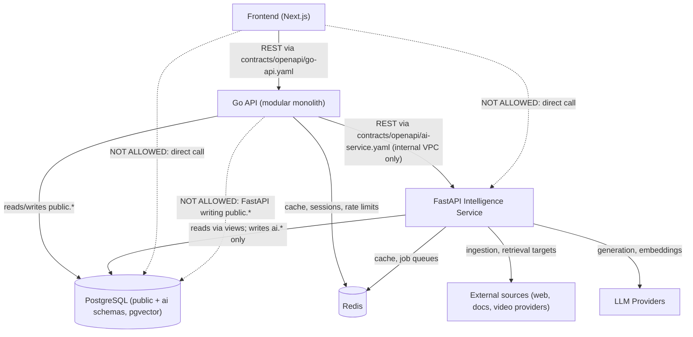

# AI-Powered Personalized Learning Platform
## System & Repository Architecture — Technical Report

*Completion ≠ Competency*

**Scope:** Repository strategy, service architecture, RAG/ML systems, contracts, infrastructure, testing, CI/CD, request flows, and deployment mapping.

> No reference project-structure images were attached to this conversation. The structure below is derived directly from the architecture (business domains → system boundaries → folder structure) rather than from any template.

---

## Table of Contents

1. [Executive Summary](#1-executive-summary)
2. [Repository Strategy](#2-repository-strategy)
3. [Top-Level System Boundaries](#3-top-level-system-boundaries)
4. [Frontend Architecture — Next.js](#4-frontend-architecture--appsweb-nextjs)
5. [Go Backend Architecture](#5-go-backend-architecture--servicesapi-go)
6. [FastAPI AI Platform Architecture](#6-fastapi-ai-platform-architecture--servicesai-fastapi)
7. [RAG / Resource Intelligence System](#7-rag--resource-intelligence-system)
8. [ML System Organization & Lifecycle](#8-ml-system-organization--lifecycle)
9. [Database & Data Access Strategy](#9-database--data-access-strategy)
10. [API Contracts Strategy](#10-api-contracts-strategy)
11. [Infrastructure Architecture](#11-infrastructure-architecture)
12. [Testing Architecture](#12-testing-architecture)
13. [Documentation Structure](#13-documentation-structure)
14. [Developer Scripts & Experience](#14-developer-scripts--experience)
15. [Configuration & Secrets Management](#15-configuration--secrets-management)
16. [Observability](#16-observability)
17. [Security](#17-security)
18. [CI/CD Pipeline Design](#18-cicd-pipeline-design)
19. [Team Ownership & CODEOWNERS](#19-team-ownership--codeowners)
20. [Dependency Rules](#20-dependency-rules)
21. [Complete Repository Structure](#21-complete-repository-structure)
22. [Directory Reference Table](#22-directory-reference-table)
23. [System Dependency Graph](#23-system-dependency-graph)
24. [Core Request Flows](#24-core-request-flows)
25. [Local Development Setup](#25-local-development-setup)
26. [AWS Deployment Mapping](#26-aws-deployment-mapping)
27. [MVP vs. Production Evolution](#27-mvp-vs-production-evolution)
28. [Architectural Quality Self-Review](#28-architectural-quality-self-review)

---

## 1. Executive Summary

This report defines the production-grade repository and system architecture for the AI-Powered Personalized Learning Platform. The platform is not a chatbot, a course recommender, or a generic RAG wrapper — it is a closed-loop competency system: it understands a learner's goal, maps it against an expert-validated skill model, diagnoses current competency, personalizes a prerequisite-respecting roadmap, retrieves and ranks trustworthy resources, generates and evaluates assessments, and adapts the next best learning action based on demonstrated evidence rather than course completion.

**Core philosophy:** Completion ≠ Competency. Every architectural decision below — the assessment-orchestration split between Go and FastAPI, the evidence ledger in the database, and the provenance-first RAG design — exists to make demonstrated understanding, not click-through, the unit of truth the system reasons over.

The architecture is organized around three service boundaries with a shared contracts layer: a Next.js/TypeScript frontend, a Go modular-monolith platform backend that owns business data and orchestration, and a Python/FastAPI intelligence backend that owns reasoning, retrieval, and model inference. This split follows one rule: **Go owns state and workflow, FastAPI owns judgment.**

The recommendation is a **monorepo** with strict internal module boundaries, **hexagonal (ports-and-adapters)** architecture inside the Go service, a domain-isolated intelligence layer inside FastAPI, and a single **OpenAPI-driven contract layer** that generates both the TypeScript and Go types consumed by the frontend and backend respectively. Infrastructure targets AWS with a deliberately minimal MVP footprint (ECS Fargate, RDS Postgres + pgvector, ElastiCache Redis, S3, ALB) and a clearly marked evolution path to independent service scaling.

---

## 2. Repository Strategy

### 2.1 Options Considered

Three strategies were evaluated against this project's actual constraints: a small team spanning frontend, Go, AI/ML, and DevOps; three languages that must agree on the same API and data contracts; a hackathon-speed starting point; and a credible path to production scaling.

| Criterion | Monorepo | Polyrepo | Hybrid |
|---|---|---|---|
| Shared contracts across 3 languages | Single PR updates schema + all consumers atomically | Contract drift is common; needs a published package + version bump per repo | Same benefit only for services grouped together |
| Local dev for a small team | One `docker-compose up`, one clone | Multiple clones, multiple version pins to keep in sync | Marginal benefit over monorepo, added clone overhead |
| CI/CD | One pipeline, path-filtered per service | N pipelines, cross-repo integration tests need orchestration | Split pipelines, same cross-repo integration problem |
| Code ownership at team scale | Enforced via CODEOWNERS + folder boundaries | Enforced by repo access controls (stronger isolation) | Partial isolation |
| Hackathon development speed | Fastest — no cross-repo coordination | Slowest to bootstrap (3+ repos, registries) | Slower than monorepo, unnecessary at current team size |
| Future independent deployment/scaling | Fully supported — each service still builds/deploys from its own Dockerfile | Native | Native for the split-out pieces |

### 2.2 Decision: Monorepo

**Chosen strategy:** a single monorepo containing the frontend, both backend services, shared contracts, infrastructure, and documentation.

The deciding factor is the shared-contract problem. This platform has two internal API boundaries that change constantly during early development: frontend ↔ Go, and Go ↔ FastAPI. In a polyrepo, every schema change becomes a coordinated multi-repo release (publish a package, bump the version in each consumer, open three PRs). In a monorepo, the same change is one PR that updates the OpenAPI spec, regenerates types, and updates all call sites in the same commit — CI proves the whole system still compiles together before merge. For a team this size, that atomicity is worth far more than the stronger repo-level isolation polyrepo would buy.

A hybrid strategy (e.g., ML/data engineering in its own repo) was rejected for now: it reintroduces the same contract-drift problem for the boundary that changes most often during build-out of the intelligence layer, with no corresponding benefit — the ML code here is a library consumed by one service (FastAPI), not an independently deployed system.

- Monorepo does **not** mean monolith deployment — the Go service, the FastAPI service, and the Next.js app each build and deploy independently from their own Dockerfile, on their own CI path, on their own schedule.
- Tooling stays deliberately simple: no Nx/Turborepo/Bazel at this scale. A root `Makefile` plus per-language native tooling (npm workspaces for TS packages, Go modules, Poetry/uv for Python) is enough and keeps onboarding low.
- Revisit this decision only if a service needs to be spun out to a separately-owned team with a separate release cadence and separate access control — see Section 27.

---

## 3. Top-Level System Boundaries

The top-level directories are a direct consequence of the domains identified above: a user-facing application, two backend services with different responsibilities (state/workflow vs. intelligence), a contract layer both must agree on, and the cross-cutting concerns (infra, docs, scripts) that support all of them.

```
learning-platform/
├── apps/              # deployable, user-facing applications
├── services/           # deployable backend services (Go platform, FastAPI intelligence)
├── packages/            # shared TypeScript code consumed only by apps/
├── contracts/             # single source of truth for cross-service APIs
├── infra/                   # infrastructure as code, environments, local dev compose
├── docs/                      # architecture, ADRs, API/database/AI docs
├── scripts/                     # developer-experience automation
├── tests/                         # SYSTEM-level tests only (e2e, contract, load)
├── .github/                         # CI/CD workflows, CODEOWNERS, PR templates
├── docker-compose.yml
├── Makefile
└── README.md
```

### 3.1 Purpose, Ownership, and Rules

| Directory | Purpose | Owner | Must NOT contain |
|---|---|---|---|
| `apps/` | User-facing deployable applications (currently: `web`) | Frontend team | Business logic that belongs in Go; direct DB or FastAPI calls |
| `services/` | Independently deployable backend services | Backend / AI teams (split by subfolder) | Cross-service imports; one service importing another's internal package |
| `packages/` | Framework-agnostic TS code shared across `apps/` (UI kit, generated-type re-exports, utilities) | Frontend team | Server-side business logic; anything specific to a single app |
| `contracts/` | OpenAPI specs, JSON Schemas, generated client/type output | Shared — cross-team review required (Section 19) | Hand-maintained duplicate types inside `apps/` or `services/` |
| `infra/` | Terraform, Docker, environment config, monitoring config | DevOps | Application code; secrets in plaintext |
| `docs/` | Architecture docs, ADRs, API/DB/AI documentation | All teams; staff-eng owns `decisions/` | Auto-generated API docs (link to `contracts/` instead of duplicating) |
| `scripts/` | Local dev, DB, CI helper scripts | DevOps + whoever touches the workflow | Long-lived application logic — scripts call services, they are not services |
| `tests/` | Cross-cutting tests spanning more than one service (e2e, contract, load, security) | QA / shared | Unit/integration tests scoped to one service — those live inside that service |
| `.github/` | Workflows, CODEOWNERS, issue/PR templates | DevOps | Deployment secrets (use OIDC + Secrets Manager instead) |

---

## 4. Frontend Architecture — `apps/web` (Next.js)

The frontend is organized around product features (goals, diagnostic, roadmap, learning workspace, assessments, competency, remediation, projects) rather than technical layers, so a single feature can be owned, reviewed, and shipped by one engineer without touching a shared `components/` dump. The App Router directory stays thin — routes compose feature modules, they don't contain business logic themselves.

### 4.1 Structure

```
apps/web/
├── src/
│   ├── app/                        # Next.js App Router — routing & composition ONLY
│   │   ├── (marketing)/             # public landing pages
│   │   ├── (auth)/
│   │   │   ├── login/page.tsx
│   │   │   └── register/page.tsx
│   │   ├── (app)/                   # authenticated shell, protected by middleware
│   │   │   ├── layout.tsx            # composes AppShell, nav, session provider
│   │   │   ├── dashboard/page.tsx
│   │   │   ├── goals/[goalId]/page.tsx
│   │   │   ├── diagnostic/[goalId]/page.tsx
│   │   │   ├── roadmap/[goalId]/page.tsx
│   │   │   ├── learn/[conceptId]/page.tsx     # learning workspace
│   │   │   ├── resources/[conceptId]/page.tsx
│   │   │   ├── assessments/[assessmentId]/page.tsx
│   │   │   ├── competency/page.tsx
│   │   │   ├── remediation/[gapId]/page.tsx
│   │   │   ├── projects/[projectId]/page.tsx
│   │   │   └── profile/page.tsx
│   │   ├── api/webhooks/               # thin route handlers ONLY (e.g. inbound webhooks)
│   │   ├── layout.tsx / error.tsx / not-found.tsx / loading.tsx
│   │   └── globals.css
│   ├── features/                       # one folder per product domain — real logic lives here
│   │   ├── auth/{components,hooks,api,types.ts,validation.ts}
│   │   ├── onboarding/...
│   │   ├── goals/...
│   │   ├── diagnostic/...
│   │   ├── roadmap/...
│   │   ├── learning-workspace/...
│   │   ├── resources/...
│   │   ├── assessments/...
│   │   ├── competency/...
│   │   ├── remediation/...
│   │   ├── dashboard/...
│   │   ├── projects/...
│   │   └── profile/...
│   ├── components/                       # cross-feature, DOMAIN-BLIND presentational UI
│   │   ├── ui/                            # design-system primitives (button, dialog, input)
│   │   ├── layout/                         # app shell, nav, sidebar
│   │   └── feedback/                        # error boundaries, skeletons, toasts, empty states
│   ├── lib/
│   │   ├── api-client/                       # fetch wrapper + generated client from contracts/
│   │   ├── auth/                              # session/token handling, refresh logic
│   │   ├── query/                              # react-query client + query key factory
│   │   ├── analytics/
│   │   └── utils/
│   ├── hooks/                                   # cross-feature hooks only (useMediaQuery, useDebounce)
│   ├── state/                                    # minimal global client state (zustand) — prefer server state
│   ├── types/                                     # re-exports of contracts/generated/ts, app-only view types
│   ├── middleware.ts                               # route protection, session refresh
│   └── config/                                      # typed env parsing, feature flags
├── public/
├── tests/{unit,component,e2e}
├── next.config.js / tsconfig.json / package.json
```

### 4.2 Rules

- A feature module may import from `components/`, `lib/`, `hooks/`, and its own subfolders — never from another feature module directly. Cross-feature composition happens in `app/` routes or via well-defined shared components.
- `components/ui` is presentational only: no data fetching, no feature-specific copy, no business rules. If a component needs to know what a "roadmap node" is, it belongs in `features/roadmap/components`, not `components/ui`.
- All server communication goes through `lib/api-client`, generated from `contracts/` (Section 10) — no feature hand-writes `fetch(...)` calls or duplicates response types.
- Server state (anything from the API) lives in react-query, not in `state/`. `state/` is reserved for genuinely client-only UI state (e.g., a multi-step wizard's current step).
- Protected routes are enforced in `middleware.ts` at the edge, not just by hiding nav links — every `(app)/` route assumes an authenticated session has already been validated before the page renders.

---

## 5. Go Backend Architecture — `services/api-go`

### 5.1 Modular Monolith, Not Microservices

For the MVP, the Go backend is a **modular monolith**: one deployable service internally organized into strongly isolated domain modules using hexagonal (ports-and-adapters) architecture. Splitting Go into microservices now would add network hops, distributed-transaction problems, and multi-service deployment overhead with no corresponding benefit — none of these domains (identity, learner, goals, roadmap, resources, assessment, competency, progress, projects, notifications) currently need independent scaling, independent release cadence, or a separately owned team. The module boundaries below give the same discipline a microservice split would, at a fraction of the operational cost, and are the exact seams to cut along if a domain later needs to be extracted.

### 5.2 Structure

```
services/api-go/
├── cmd/
│   ├── api/main.go              # HTTP server entrypoint
│   ├── worker/main.go            # background jobs (notifications, async orchestration)
│   └── migrate/main.go            # migration runner CLI
├── internal/
│   ├── platform/                    # cross-cutting technical concerns — NO business logic
│   │   ├── config/  logger/  tracing/  httpserver/
│   │   ├── middleware/               # auth, request-id, recover, cors, rate-limit
│   │   ├── database/                  # pgx pool, tx helpers
│   │   ├── cache/                      # redis client
│   │   └── events/                      # outbox / pub-sub helpers
│   ├── identity/                    # domain: auth, users, sessions
│   │   ├── domain/  application/  infrastructure/  interfaces/
│   ├── learner/                     # domain: learner profile, preferences, learning history
│   ├── goals/                       # domain: learning goals
│   ├── roadmap/                     # domain: roadmap management, prerequisite graph state
│   ├── resources/                   # domain: resource metadata/catalog (ranking logic lives in FastAPI)
│   ├── assessment/                  # domain: orchestration, attempts, scoring records
│   ├── competency/                  # domain: competency state, evidence ledger
│   ├── progress/                    # domain: progress across roadmap nodes
│   ├── projects/                    # domain: project-based learning artifacts
│   ├── notifications/               # domain: preferences & delivery
│   └── aiclient/                    # infrastructure adapter — typed client into FastAPI
├── pkg/                              # code meant for reuse OUTSIDE this module (empty at MVP)
├── migrations/                        # SQL migrations — the golden schema, source of truth
├── api/                                 # generated server stubs/types from contracts/openapi
├── configs/                              # env-specific, non-secret config files
├── test/{integration, testdata}
├── Dockerfile
├── go.mod
```

Each domain module (e.g. `roadmap/`) follows the same four-layer internal shape:

```
roadmap/
├── domain/          # entities, value objects, domain errors, PORT interfaces — zero framework imports
├── application/       # use-cases / services (CreateRoadmap, PersonalizeRoadmap, ...)
├── infrastructure/      # ADAPTERS: postgres repo impl, redis cache impl, aiclient calls
└── interfaces/            # HTTP handlers, DTOs, route registration
```

### 5.3 Rules

- **Dependency direction:** `interfaces → application → domain`. `infrastructure` implements interfaces defined *by* `domain` (dependency inversion) — domain code never imports a database driver, an HTTP framework, or an SDK.
- `internal/` is genuinely internal — Go's compiler enforces that nothing outside this module can import it, which is exactly the boundary a modular monolith needs.
- `aiclient` is infrastructure, not a domain: from the domain layer's point of view, FastAPI is an external system reached through a port, identical in spirit to reaching Postgres or Redis.
- No domain module imports another domain module's `infrastructure` or `interfaces` package directly; cross-domain calls go through the other domain's `application` service interface, injected at composition time in `cmd/api/main.go`.

---

## 6. FastAPI AI Platform Architecture — `services/ai-fastapi`

### 6.1 Design Principle

The intelligence backend is split into isolated **intelligence domains**, each owning one piece of reasoning named directly from the product spec — goal understanding, skill intelligence, recommendation, resource intelligence, assessment, competency, remediation, adaptive learning — plus three shared platform layers (`rag/`, `llm/`, `ml/`) that those domains consume. This is deliberately not a single `model.py` / `app.py` pair: each domain can be developed, tested, and evaluated independently, and a domain that later warrants heavier infrastructure (e.g., a learned resource ranker) can grow without destabilizing the others.

### 6.2 Structure

```
services/ai-fastapi/
├── app/
│   ├── main.py                         # app factory, router registration
│   ├── api/v1/                          # HTTP interface layer — thin, delegates to domains/
│   │   ├── goal_understanding.py  skill_intelligence.py  recommendation.py
│   │   ├── resource_intelligence.py  assessment.py  competency.py
│   │   ├── remediation.py  adaptive.py  deps.py     # shared deps: auth, db session
│   ├── domains/                          # intelligence domains — the actual reasoning
│   │   ├── goal_understanding/
│   │   │   ├── service.py  prompts/  schemas.py  skill_taxonomy_mapper.py
│   │   ├── skill_intelligence/           # prerequisite graph reasoning, gap analysis
│   │   │   ├── service.py  prerequisite_graph.py  gap_analysis.py
│   │   ├── recommendation/                # roadmap personalization + next-best-action
│   │   │   ├── roadmap_personalizer.py  next_action_policy.py
│   │   ├── resource_intelligence/          # ranks resources retrieved via rag/
│   │   │   ├── ranker.py  quality_scoring.py
│   │   ├── assessment/                      # generation + evaluation
│   │   │   ├── generator.py  evaluator.py  item_bank/
│   │   ├── competency/                       # competency estimation from evidence
│   │   │   ├── estimator.py  evidence_model.py
│   │   ├── remediation/
│   │   │   └── remediation_planner.py
│   │   └── adaptive_learning/                 # decides the next loop iteration
│   │       └── policy.py
│   ├── rag/                                    # resource intelligence / knowledge system — Section 7
│   ├── llm/                                      # LLM orchestration
│   │   ├── providers/  orchestrator.py  prompts/  guardrails/
│   ├── ml/                                        # ML lifecycle — Section 8
│   ├── infrastructure/
│   │   ├── db/  cache/  vectorstore/  queue/  external/
│   ├── core/                                        # config, logging, security, exceptions
│   └── evaluation/                                    # offline eval harness for prompts/models
├── tests/
├── notebooks/                                          # exploratory only — never imported by app/
├── Dockerfile
├── pyproject.toml
```

### 6.3 Rules

- `api/` depends on `domains/`; `domains/` never import from `api/` — no circular dependency between the HTTP layer and the reasoning layer.
- `domains/` may depend on `llm/`, `rag/`, `ml/`, and `infrastructure/`, but domains do not import each other's internals — cross-domain composition (e.g., `adaptive_learning` calling `recommendation` and `remediation`) happens through each domain's public `service.py` interface only.
- `guardrails/` in `llm/` is where AI-safety checks live: output validation, prompt-injection detection on ingested content, PII scrubbing before logging. This is intentionally a shared, mandatory layer every LLM call passes through, not something each domain reimplements.

---

## 7. RAG / Resource Intelligence System

This is a **resource intelligence system embedded in a learning platform**, not a generic RAG tutorial pipeline. The distinguishing requirement is provenance: every retrieved chunk must be traceable to a trust-scored, licensed source, because the platform recommends resources to learners and must be able to justify *why* a resource is trustworthy, not just *why* it's semantically similar.

```
app/rag/
├── ingestion/
│   ├── loaders/            # per-source-type: web, docs, video_transcript, curated_manifest
│   ├── parsers/              # html→text, pdf, transcript normalization
│   ├── normalization/          # dedup, language detection, cleanup
│   └── pipeline.py               # orchestrates loader → parser → normalize → chunk → embed → index
├── chunking/strategies.py
├── embeddings/embedder.py       # model-agnostic embedding interface
├── indexing/pgvector_indexer.py
├── retrieval/
│   ├── retriever.py
│   └── query_rewriting.py
├── reranking/reranker.py
├── provenance/                     # THE differentiator vs. generic RAG
│   ├── source_registry.py           # trusted-source allowlist; expert-curated roadmap sources
│   ├── verification.py               # source trust-tier scoring
│   ├── freshness.py                   # staleness detection, re-crawl triggers
│   └── citation.py                     # maps a retrieved chunk back to a citable source + license
└── evaluation/
    ├── retrieval_eval.py               # recall/precision on a golden query set
    └── golden_sets/
```

- Every indexed chunk is stored with `source_id`, `trust_tier`, `license`, and `last_verified_at` — provenance is a first-class column, not metadata bolted on later.
- `resource_intelligence/ranker.py` (Section 6) consumes semantic similarity **and** trust tier, freshness, and pedagogical fit — cosine similarity alone never determines what a learner sees.
- Expert-defined "gold-standard" roadmaps referenced in the product spec are ingested through the same `source_registry` as the highest trust tier, so the personalization layer can always fall back to them when generated content is uncertain.

---

## 8. ML System Organization & Lifecycle

```
app/ml/
├── data/
│   ├── schemas/            # pandera/pydantic validation schemas for training data
│   └── loaders/              # pull from S3/warehouse — never store raw data in-repo
├── features/                   # feature engineering (competency features, engagement features)
├── training/                     # train_*.py scripts (competency estimator, learned ranker if used)
├── evaluation/                     # offline metrics, slice analysis
├── registry/model_registry_client.py   # thin client to the model registry — no binaries committed
└── monitoring/
    ├── drift_detection.py
    └── prediction_logging.py
```

**Where artifacts live:** `data/raw/`, `data/processed/`, and trained model binaries are **not committed to Git**. Raw and processed data live in S3 (`raw/`, `processed/`, `artifacts/` prefixes); model versions are tracked in a model registry (MLflow, self-hosted or managed, or a cloud provider's registry). `ai-fastapi` loads the current production model pointer from the registry at startup and on a refresh interval — the repository holds pipeline *code*, never data or weights. Only small, deterministic fixtures for unit tests are committed under `app/ml/tests/fixtures`.

---

## 9. Database & Data Access Strategy

PostgreSQL is the single database, but ownership is explicit and non-overlapping:

- **Go owns the canonical relational schema** — users, learners, goals, roadmaps, roadmap_nodes, prerequisites, resource metadata, progress, assessment attempts, competency_state, evidence, notifications, projects. `services/api-go/migrations/` is the single source of truth for this schema, managed with `golang-migrate` (or Atlas).
- **FastAPI does not own these tables and does not run migrations against them.** It reads learner/roadmap/goal context through explicit, versioned **read-only SQL views** — not raw tables — so Go can evolve internal columns without silently breaking the AI service. The views *are* the contract for this boundary.
- **FastAPI owns a separate `ai` schema** for AI-specific tables it writes to directly: `rag_chunks`/embeddings (pgvector), `llm_generation_log`, `model_predictions_log`. This schema has its own lightweight Alembic migration chain, scoped only to `ai.*` — so there is exactly one migration owner per schema, never two systems racing to alter the same table.
- No ORM model is ever duplicated for the same table between Go and Python. If both need the same data, one owns the table and the other reads a view.

---

## 10. API Contracts Strategy

```
contracts/
├── openapi/
│   ├── go-api.yaml          # Go service's REST contract (frontend ↔ Go)
│   └── ai-service.yaml        # FastAPI's contract (Go ↔ FastAPI), exported from Pydantic models
├── json-schema/events/          # async event payloads (notifications, webhooks), if any
├── generated/                     # OUTPUT of codegen — gitignored, produced by `make generate`
│   ├── ts/                          # openapi-typescript output, consumed by apps/web
│   └── go/                            # oapi-codegen output, consumed by services/api-go/api
└── README.md                            # versioning policy, breaking-change process
```

OpenAPI is the single source of truth for both internal boundaries: frontend ↔ Go, and Go ↔ FastAPI. `make generate` runs in CI and locally to produce TypeScript types (`openapi-typescript`) and Go server interfaces (`oapi-codegen`) from the same spec, so request/response types are never hand-duplicated in three languages. **No protobuf/gRPC is needed at this scale** — REST/JSON is sufficient; protobuf is called out in Section 27 as a future option only if Go↔FastAPI internal traffic becomes a genuine bottleneck.

---

## 11. Infrastructure Architecture

```
infra/
├── docker/
│   └── docker-compose.yml       # local dev: postgres(+pgvector), redis, api-go, ai-fastapi, web
├── terraform/
│   ├── modules/                   # vpc, ecs-service, rds, elasticache, s3 — reusable
│   └── environments/{dev,staging,prod}/
├── monitoring/{dashboards,alerts}/
└── README.md
```

MVP infrastructure is deliberately minimal: one ECS Fargate cluster, one RDS Postgres instance with the `pgvector` extension enabled (no separate vector database), one ElastiCache Redis, an Application Load Balancer with path-based routing (`/api/*` → Go, publicly; FastAPI is **not** publicly exposed — Go is the only public entry point), S3 for object storage, and CloudWatch for logs and metrics. No nginx layer is needed in front of an ALB at this scale.

---

## 12. Testing Architecture

| Layer | Test types | Location | Notes |
|---|---|---|---|
| Frontend | Unit, component, integration, E2E | `apps/web/tests/{unit,component,e2e}` | E2E via Playwright, run against a docker-composed stack in CI |
| Go | Unit, integration, API, repository, service, contract | `internal/<domain>/**/*_test.go` (unit/service), `services/api-go/test/integration` | Repository tests run against a real Postgres testcontainer, not mocks |
| FastAPI | Unit, integration, inference, RAG, evaluation | `services/ai-fastapi/tests/{unit,integration,rag,evaluation}` | RAG tests run retrieval quality against `rag/evaluation/golden_sets` |
| ML | Data validation, feature tests, model tests, evaluation, regression | `app/ml/**/tests` | Data validation runs the `pandera` schemas in `ml/data/schemas` against sample batches |
| System | Contract, E2E, load, security | `tests/{contract,e2e,load,security}` (top-level) | Contract tests validate both services against `contracts/openapi/*.yaml`; load via k6; security via OWASP ZAP baseline scan |

Unit and integration tests scoped to a single service live *inside* that service, next to the code — this keeps ownership matched to the CODEOWNERS boundaries in Section 19. Only genuinely cross-service tests (contract validation, full E2E flows, load, security scanning) live in the top-level `tests/` directory, because they require the whole stack running together.

---

## 13. Documentation Structure

```
docs/
├── architecture/
│   ├── overview.md
│   └── diagrams/
├── decisions/                # Architecture Decision Records, numbered
│   ├── 0001-monorepo-strategy.md
│   ├── 0002-modular-monolith-go.md
│   └── 0003-provenance-first-rag.md
├── api/                        # links to contracts/openapi rendered docs — not duplicated content
├── database/{schema.md, erd.png}
├── ai/{prompts.md, evaluation.md}
├── deployment/
├── development/getting-started.md
└── CONTRIBUTING.md
```

ADRs are required for any decision in Sections 2, 5, 6, 9, and 11 of this report (repo strategy, monolith-vs-microservices, contract strategy, database ownership, infra shape) — these are exactly the decisions expensive to reverse later, and staff-eng review is required before merging a new ADR (see CODEOWNERS, Section 19).

---

## 14. Developer Scripts & Experience

```
scripts/
├── dev/{up.sh, seed.sh}
├── db/{migrate.sh, reset.sh}
├── lint.sh
├── test.sh
└── ci/
```

A root **Makefile** is the single entry point (`make up`, `make migrate`, `make seed`, `make dev`, `make test`, `make lint`, `make generate`) — chosen over Taskfile/justfile because it requires zero extra dependency and every engineer already has `make`. Scripts under `scripts/` are thin wrappers Make calls into; they never contain business logic themselves.

---

## 15. Configuration & Secrets Management

- Each service ships a `.env.example`; real `.env` files are local-only and gitignored everywhere.
- Staging and production secrets live in **AWS Secrets Manager**, injected into ECS tasks as environment variables at deploy time — never baked into container images, never committed.
- Feature flags start as a simple DB-backed table read by Go at request time; a dedicated flagging service (LaunchDarkly-class tooling) is explicitly deferred (Section 27) until the flag count or targeting complexity justifies it.
- Configuration is layered: local → dev → staging → prod, with environment-specific Terraform variable files in `infra/terraform/environments/*` and non-secret service config in `services/*/configs/`.

---

## 16. Observability

- **Structured logging:** JSON logs in both services (`slog` in Go, `structlog` in Python), correlated by a request ID propagated from the ALB through Go into FastAPI.
- **Metrics:** Prometheus-format `/metrics` endpoints on both services; CloudWatch Container Insights is sufficient at MVP scale, with a path to self-hosted Grafana if dashboard needs grow.
- **Tracing:** OpenTelemetry SDKs in both Go and FastAPI from day one (even before a collector is deployed), so distributed traces across the frontend → Go → FastAPI → Postgres path are available as soon as they're needed.
- **AI-specific observability:** every LLM call is logged to `ai.llm_generation_log` (prompt version, token counts, latency, cost); every model prediction used in competency estimation or ranking is logged to `ai.model_predictions_log` for drift detection — this is what makes the "adaptive learning" loop auditable, not a black box.

---

## 17. Security

- **AuthN:** owned entirely by Go — short-lived JWT access tokens plus refresh tokens, passwords hashed with argon2id.
- **AuthZ:** RBAC enforced in the Go `interfaces/` layer via middleware, close to the HTTP boundary, not scattered through application services.
- **Secrets:** never committed; AWS Secrets Manager + IAM task roles — no long-lived AWS access keys inside containers.
- **Dependency scanning:** Dependabot on all three package ecosystems, plus `govulncheck` (Go), `pip-audit` (Python), and `npm audit` (TS), wired into CI (Section 18).
- **Input validation:** Go DTOs use struct validation tags at the `interfaces/` boundary; FastAPI uses Pydantic models everywhere requests enter.
- **Rate limiting:** enforced in Go middleware at the edge, per-user and per-IP, before any request reaches FastAPI.
- **Audit logging:** sensitive actions (authentication events, manual competency overrides) are written to an append-only audit log, never mutated.
- **Service-to-service:** Go → FastAPI traffic stays inside the VPC, never publicly routable; a shared internal auth header is acceptable at MVP, explicitly flagged in Section 27 as an upgrade candidate (mTLS) once the team has bandwidth for it.

---

## 18. CI/CD Pipeline Design

GitHub Actions workflows are path-filtered so an unrelated change never triggers an unrelated pipeline. Seven workflows cover the system — not dozens:

| Workflow | Trigger | Path filter | Purpose |
|---|---|---|---|
| `ci-web.yml` | PR | `apps/web/**`, `packages/**` | Lint, typecheck, unit tests, build |
| `ci-go.yml` | PR | `services/api-go/**` | `go vet`, lint, unit + integration tests (with Postgres/Redis service containers) |
| `ci-python.yml` | PR | `services/ai-fastapi/**` | `ruff`/`black`, `mypy`, `pytest` |
| `ci-contracts.yml` | PR | `contracts/**` | Validate OpenAPI specs, fail if generated output is stale (codegen diff check) |
| `security-scan.yml` | PR + nightly schedule | repo-wide | Dependabot alert consolidation, Trivy image scan |
| `docker-build.yml` | push to `main` | repo-wide | Build & push service images to ECR |
| `deploy-staging.yml` / `deploy-prod.yml` | push to `main` (staging, automatic) / manual approval (prod) | — | Terraform apply + ECS service update |

---

## 19. Team Ownership & CODEOWNERS

```
# .github/CODEOWNERS
apps/web/**                 @frontend-team
services/api-go/**          @backend-team
services/ai-fastapi/**      @ai-team
contracts/**                @backend-team @ai-team @frontend-team   # cross-team review required
infra/**                    @devops-team
docs/decisions/**           @staff-eng                              # ADRs need architectural review
```

The `contracts/**` line is the important one: because it requires sign-off from all three teams, no service can silently change a shared API without the consumers of that API seeing the diff in the same PR — this is the enforcement mechanism behind the monorepo's core benefit (Section 2).

---

## 20. Dependency Rules

- **Frontend → contracts (generated types) + Go public API only.** The frontend never calls FastAPI directly and never touches the database directly.
- **Go `interfaces` → Go `application` → Go `domain`.** `domain` has zero framework or infrastructure imports; `infrastructure` implements interfaces *defined by* `domain` (dependency inversion).
- **Go → FastAPI** only through the `aiclient` infrastructure adapter — from the domain's perspective, FastAPI is an external system, exactly like Postgres or Redis.
- **FastAPI `api/` → `domains/`** ; `domains/` never import `api/` (no circular dependency between transport and reasoning layers).
- **FastAPI `infrastructure/db`** reads Go-owned tables only through explicit read-only views, and writes only to the `ai` schema it owns.
- **No service reaches into another service's `internal/` (Go) or `app/domains/` (Python) directly** — all cross-service communication happens over the HTTP contracts in Section 10, never through shared imports or a shared database write.

---

## 21. Complete Repository Structure

```
learning-platform/
├── apps/
│   └── web/                                    # Next.js 14+ (App Router), TypeScript
│       ├── src/
│       │   ├── app/                             # (marketing) (auth) (app) route groups — Section 4
│       │   ├── features/                         # auth, goals, diagnostic, roadmap, learning-workspace,
│       │   │                                      # resources, assessments, competency, remediation,
│       │   │                                      # dashboard, projects, profile, onboarding
│       │   ├── components/{ui,layout,feedback}/
│       │   ├── lib/{api-client,auth,query,analytics,utils}/
│       │   ├── hooks/  state/  types/  config/  middleware.ts
│       │   └── styles/
│       ├── public/
│       ├── tests/{unit,component,e2e}/
│       └── next.config.js, tsconfig.json, package.json
│
├── services/
│   ├── api-go/                                  # Go modular monolith — Section 5
│   │   ├── cmd/{api,worker,migrate}/
│   │   ├── internal/
│   │   │   ├── platform/{config,logger,tracing,httpserver,middleware,database,cache,events}/
│   │   │   ├── identity/{domain,application,infrastructure,interfaces}/
│   │   │   ├── learner/{domain,application,infrastructure,interfaces}/
│   │   │   ├── goals/{domain,application,infrastructure,interfaces}/
│   │   │   ├── roadmap/{domain,application,infrastructure,interfaces}/
│   │   │   ├── resources/{domain,application,infrastructure,interfaces}/
│   │   │   ├── assessment/{domain,application,infrastructure,interfaces}/
│   │   │   ├── competency/{domain,application,infrastructure,interfaces}/
│   │   │   ├── progress/{domain,application,infrastructure,interfaces}/
│   │   │   ├── projects/{domain,application,infrastructure,interfaces}/
│   │   │   ├── notifications/{domain,application,infrastructure,interfaces}/
│   │   │   └── aiclient/                          # adapter into ai-fastapi
│   │   ├── pkg/                                     # empty at MVP — reuse-outside-module code only
│   │   ├── migrations/                                # golden schema (public.*)
│   │   ├── api/                                         # generated from contracts/openapi/go-api.yaml
│   │   ├── configs/  test/{integration,testdata}/  Dockerfile  go.mod
│   │
│   └── ai-fastapi/                              # Python intelligence backend — Section 6
│       ├── app/
│       │   ├── main.py
│       │   ├── api/v1/{goal_understanding,skill_intelligence,recommendation,
│       │   │           resource_intelligence,assessment,competency,remediation,adaptive,deps}.py
│       │   ├── domains/
│       │   │   ├── goal_understanding/  skill_intelligence/  recommendation/
│       │   │   ├── resource_intelligence/  assessment/  competency/
│       │   │   ├── remediation/  adaptive_learning/
│       │   ├── rag/{ingestion,chunking,embeddings,indexing,retrieval,reranking,provenance,evaluation}/
│       │   ├── llm/{providers,orchestrator.py,prompts,guardrails}/
│       │   ├── ml/{data,features,training,evaluation,registry,monitoring}/
│       │   ├── infrastructure/{db,cache,vectorstore,queue,external}/
│       │   ├── core/  evaluation/
│       │   └── (Alembic chain scoped to the `ai` schema only)
│       ├── tests/{unit,integration,rag,evaluation}/
│       ├── notebooks/                              # exploratory only, gitignored outputs
│       └── Dockerfile  pyproject.toml
│
├── packages/
│   └── (shared TS: ui-kit re-exports, cross-app utilities — empty until a 2nd app exists)
│
├── contracts/
│   ├── openapi/{go-api.yaml, ai-service.yaml}
│   ├── json-schema/events/
│   ├── generated/{ts,go}/                        # gitignored — produced by `make generate`
│   └── README.md
│
├── infra/
│   ├── docker/docker-compose.yml
│   ├── terraform/{modules,environments/{dev,staging,prod}}/
│   └── monitoring/{dashboards,alerts}/
│
├── docs/
│   ├── architecture/{overview.md,diagrams}/
│   ├── decisions/0001-…, 0002-…, 0003-…
│   ├── api/  database/  ai/  deployment/  development/
│   └── CONTRIBUTING.md
│
├── scripts/{dev,db}/  lint.sh  test.sh  ci/
│
├── tests/{contract,e2e,load,security}/          # SYSTEM-level only
│
├── .github/{workflows/*.yml, CODEOWNERS, PULL_REQUEST_TEMPLATE.md}
│
├── docker-compose.yml
├── Makefile
└── README.md
```

---

## 22. Directory Reference Table

| Path | Purpose | Owner | Important Rules |
|---|---|---|---|
| `apps/web/src/app` | Routing & composition | Frontend | No business logic; composes `features/` |
| `apps/web/src/features/*` | Product-domain UI, hooks, API calls | Frontend | No cross-feature imports |
| `apps/web/src/components/ui` | Presentational design system | Frontend | Domain-blind; no data fetching |
| `apps/web/src/lib/api-client` | Typed server communication | Frontend | Sole path to the backend; generated from `contracts/` |
| `services/api-go/internal/platform` | Cross-cutting technical infra | Backend | No business/domain logic |
| `services/api-go/internal/<domain>/domain` | Entities, ports, domain errors | Backend | Zero framework imports |
| `services/api-go/internal/<domain>/application` | Use-cases | Backend | Depends only on `domain` |
| `services/api-go/internal/<domain>/infrastructure` | Adapters (Postgres, Redis, aiclient) | Backend | Implements `domain` ports, never called by `domain` |
| `services/api-go/internal/aiclient` | Client into FastAPI | Backend | Treated as an external-system adapter |
| `services/api-go/migrations` | Canonical schema (source of truth) | Backend | Only Go migrates `public.*` |
| `services/ai-fastapi/app/api` | HTTP layer | AI/ML | Thin; delegates to `domains/` |
| `services/ai-fastapi/app/domains/*` | Reasoning per capability | AI/ML | No imports from `api/`; no cross-domain internals |
| `services/ai-fastapi/app/rag` | Resource intelligence / provenance | AI/ML | `provenance/` is mandatory, not optional |
| `services/ai-fastapi/app/llm` | LLM orchestration + guardrails | AI/ML | Every LLM call passes through `guardrails/` |
| `services/ai-fastapi/app/ml` | Training/eval/registry pipeline code | AI/ML, Data | No data or model binaries committed |
| `services/ai-fastapi` (ai schema) | AI-owned Postgres tables | AI/ML | Only AI service migrates `ai.*` |
| `contracts/` | OpenAPI source of truth | Cross-team | Requires review from all 3 teams |
| `contracts/generated/` | Codegen output | — | Gitignored; regenerated via `make generate` |
| `infra/terraform` | AWS infrastructure as code | DevOps | Environment-scoped variables, no hardcoded secrets |
| `docs/decisions` | ADRs | Staff-eng | Required for the decisions in Sections 2, 5, 6, 9, 11 |
| `tests/` (top-level) | Cross-service tests only | QA | Not a home for single-service unit tests |
| `.github/workflows` | CI/CD | DevOps | Path-filtered; 7 workflows, not dozens |

---

## 23. System Dependency Graph



The dotted edges mark the boundaries the architecture actively forbids: the frontend never reaches FastAPI or Postgres directly, and FastAPI never writes to the tables Go owns. Every one of those paths goes through a contract, not a shortcut.

---

## 24. Core Request Flows

### 24.1 User Login
`Frontend (login form)` → `Go /auth/login` → validates credentials against `identity` domain → `Postgres` (users) → issues JWT + refresh token → `Redis` (session/rate-limit state) → response to Frontend, which stores tokens via `lib/auth`.

### 24.2 Goal Creation
`Frontend (goal form)` → `Go /goals` → `goals` domain persists the raw goal → Go calls `FastAPI /v1/goal-understanding` → `goal_understanding` domain parses intent, maps it against the skill taxonomy (via `skill_intelligence`) → returns a structured goal representation → Go persists it and returns the created goal to the Frontend.

### 24.3 Diagnostic Assessment
`Frontend` requests a diagnostic → `Go /goals/{id}/diagnostic` → Go calls `FastAPI /v1/assessment/generate` (diagnostic mode) → `assessment.generator` produces items scoped to the mapped skill area → Go stores the assessment shell in `public.assessments` → Frontend renders it; on submission, `Go /assessments/{id}/submit` → Go forwards answers to `FastAPI /v1/assessment/evaluate` → `assessment.evaluator` scores + emits initial competency signal → `competency.estimator` writes to the evidence model → Go persists competency_state and evidence rows.

### 24.4 Personalized Roadmap Generation
`Go /goals/{id}/roadmap` → Go fetches the expert-defined gold-standard roadmap for the mapped goal (from `roadmap` domain) → calls `FastAPI /v1/recommendation/personalize-roadmap` with the learner's diagnosed competency state → `skill_intelligence.gap_analysis` + `recommendation.roadmap_personalizer` reorder/prune nodes while respecting prerequisite edges → Go persists the personalized roadmap and returns it to the Frontend.

### 24.5 Resource Retrieval
`Frontend (roadmap node)` → `Go /resources?concept={id}` → Go calls `FastAPI /v1/resource-intelligence/retrieve` → `rag.retrieval.retriever` queries pgvector, `reranking.reranker` reorders by relevance, `resource_intelligence.ranker` re-weights by trust tier + freshness → response includes provenance/citation for each result → Go caches metadata and returns ranked resources to the Frontend.

### 24.6 Learning a Concept
`Frontend (learning workspace)` → `Go /learn/{conceptId}` → Go calls `FastAPI /v1/goal-understanding` (concept explanation mode), which combines an LLM-generated explanation (`llm/orchestrator`) with retrieved trusted resources (`rag/retrieval`) → response streamed back through Go to the Frontend, with citations attached from `rag/provenance/citation.py`.

### 24.7 Assessment Submission
`Frontend` submits answers → `Go /assessments/{id}/submit` → Go persists the raw attempt → calls `FastAPI /v1/assessment/evaluate` → `assessment.evaluator` scores against the item bank/rubric → returns per-item results + confidence → Go persists results to `public.assessments` and appends to the evidence ledger.

### 24.8 Competency Update
Triggered internally after 24.3/24.7 → `Go` forwards new evidence to `FastAPI /v1/competency/estimate` → `competency.estimator` recomputes the learner's competency state using the accumulated evidence model (not just the latest score) → Go writes updated `competency_state` → Frontend's dashboard reflects the change on next fetch.

### 24.9 Remediation
Triggered when `skill_intelligence.gap_analysis` or `competency.estimator` flags a weak area → `Go /remediation/{gapId}` → `FastAPI /v1/remediation/plan` → `remediation.remediation_planner` selects targeted resources and practice items for the specific gap → Go persists a remediation plan node attached to the learner's roadmap → Frontend surfaces it in the `remediation/` feature.

### 24.10 Adaptive Next-Step Recommendation
After any learning-loop event (resource viewed, assessment submitted, remediation completed) → `Go` calls `FastAPI /v1/adaptive/next-action` → `adaptive_learning.policy` reads current competency state, roadmap position, and recent evidence, and decides the next best action (new concept, more practice, remediation, or goal-complete) → Go persists the decision and the Frontend routes the learner accordingly, closing the learn → assess → competency → adapt loop.

---

## 25. Local Development Setup

```
1. git clone <repo>
2. cp .env.example .env               (root + per-service, fill in local values)
3. make up                            # docker-compose: postgres(+pgvector), redis
4. make migrate                       # runs Go migrations against public schema
5. make migrate-ai                    # runs FastAPI's Alembic chain against ai schema
6. make seed                          # loads synthetic learner/goal/roadmap fixtures
7. make generate                      # regenerates contracts/generated/{ts,go} from OpenAPI
8. make dev-go        # or: cd services/api-go && go run ./cmd/api
9. make dev-ai         # or: cd services/ai-fastapi && uvicorn app.main:app --reload
10. make dev-web        # or: cd apps/web && npm run dev
```

`make dev` runs 8–10 concurrently for a one-command full-stack start. A new developer needs Docker, Go, Python (with `uv` or Poetry), and Node — no other host dependencies.

---

## 26. AWS Deployment Mapping

| Component | AWS Service | Rationale |
|---|---|---|
| `apps/web` (Next.js) | **Amplify Hosting** or **Vercel-style ECS Fargate task behind the ALB** — recommend Amplify for MVP simplicity, revisit if SSR/edge needs grow | Zero-ops static/SSR hosting; avoids managing a Node container for a hackathon-speed team |
| `services/api-go` | **ECS Fargate** (public, behind ALB) | Stateless Go binary in a small container; Fargate avoids managing EC2 hosts |
| `services/ai-fastapi` | **ECS Fargate** (private, VPC-internal only, not attached to the public ALB listener) | Same operational model as Go; kept off the public internet since it's an internal service |
| PostgreSQL + pgvector | **RDS PostgreSQL** (single instance, Multi-AZ later) | Managed backups/patching; `pgvector` avoids standing up a separate vector DB |
| Redis | **ElastiCache for Redis** | Managed, low-ops caching/session/rate-limit store |
| Object storage (raw/processed ML data, model artifacts) | **S3** | Standard, cheap, integrates with the model registry |
| Secrets | **AWS Secrets Manager** | Injected as ECS task env vars via IAM task roles |
| CI/CD | **GitHub Actions** → **ECR** → ECS deploy | Matches Section 18; no separate CD tool needed at this scale |
| Logs/metrics | **CloudWatch (Container Insights)** | Zero-setup baseline observability; Grafana is a later upgrade, not an MVP requirement |
| Networking | **VPC with public subnets (ALB, web) and private subnets (Go, FastAPI, RDS, Redis)** | FastAPI and the data layer are never internet-routable |

---

## 27. MVP vs. Production Evolution

**Build now (MVP / hackathon):**
- Single Go modular monolith, single FastAPI service, both on ECS Fargate.
- One RDS Postgres instance (two schemas: `public`, `ai`), pgvector for retrieval — no separate vector database.
- CloudWatch-only observability; OTel SDKs installed but no dedicated collector/Grafana yet.
- Shared internal auth header between Go and FastAPI, over the private VPC.
- Feature flags as a plain DB table.
- Amplify (or a single ECS task) for the frontend.

**Explicitly deferred to production evolution:**
- Splitting any Go domain module (e.g., `assessment` or `roadmap`) into its own microservice — only if it needs independent scaling or an independently owned team; the module boundary already exists to make this a low-risk extraction later.
- gRPC/protobuf for Go↔FastAPI traffic — only if REST/JSON becomes a measured bottleneck.
- mTLS between Go and FastAPI, replacing the shared internal header.
- A dedicated vector database (e.g., if `pgvector` scaling limits are actually hit) — not assumed up front.
- Self-hosted Grafana/Prometheus, or a managed APM — once CloudWatch's dashboards are genuinely insufficient.
- A dedicated feature-flagging service — once the DB-table approach starts blocking targeted rollouts.
- RDS Multi-AZ, read replicas, and ElastiCache clustering — once traffic/availability requirements justify the added cost.

Avoid building any of the deferred items during the hackathon; each is a low-regret addition later precisely because the module and contract boundaries above already make room for it.

---

## 28. Architectural Quality Self-Review

| Question | Verdict | Why |
|---|---|---|
| Is it understandable? | Yes | Domain names in the folder tree match the product's own vocabulary (goals, roadmap, competency) — no translation layer needed to navigate the code |
| Is it scalable? | Yes, for the next stage | Modular monolith boundaries are pre-cut extraction seams; ECS services scale independently already |
| Is it maintainable? | Yes | Hexagonal layering in Go and domain isolation in FastAPI keep business rules out of framework code |
| Is it testable? | Yes | Domain/application layers have zero infra dependencies, so they're unit-testable without a database or HTTP server |
| Is ownership clear? | Yes | CODEOWNERS maps 1:1 to the top-level and service-level folders |
| Are dependencies clean? | Yes | Section 20 states explicit, enforceable rules; the dotted edges in Section 23 name what's forbidden, not just what's allowed |
| Are frontend/backend/AI boundaries clear? | Yes | Frontend never reaches FastAPI or Postgres directly; Go is the only public API surface |
| Is database ownership clear? | Yes | Two schemas, two migration owners, views as the cross-boundary contract |
| Is RAG isolated appropriately? | Yes | `rag/` is a platform layer under FastAPI, consumed by domains — not duplicated per domain |
| Can multiple developers work in parallel? | Yes | Feature modules (frontend) and domain modules (Go/FastAPI) are independently ownable units |
| Can components deploy independently where necessary? | Yes | Each service has its own Dockerfile and CI path despite living in one repo |
| Is the architecture overengineered for a hackathon team? | Mitigated | Section 27 explicitly defers microservices, gRPC, mTLS, and dedicated observability tooling until there's a measured need |
| Is anything still a risk? | Yes — flagged | The Go↔FastAPI shared-header auth (Section 17) and single-instance RDS (no Multi-AZ) are conscious MVP trade-offs, not oversights; both are named explicitly in Section 27 as the first things to upgrade post-hackathon |

**Overall:** the structure satisfies the stated requirement — a repository an experienced team could start implementing against immediately — while keeping the MVP surface area deliberately small and naming every place where production hardening is deferred rather than forgotten.

---

*End of report.*
