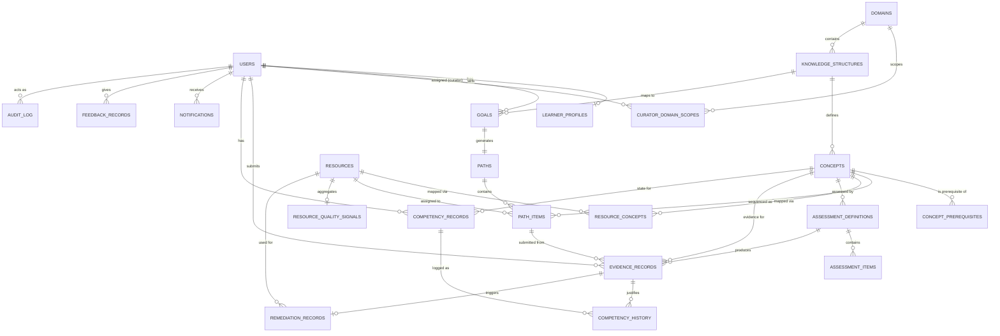

# Database Design
## AI-Powered Personalized Learning Platform

*Built strictly on the approved Blueprint, SRS, UX Design, and Technical Architecture. PostgreSQL + pgvector + Redis confirmed as sufficient — no requirement identified that these can't satisfy, so the stack is unchanged (see Section 4 for the specific justification on graph representation, the one area most likely to invite a "you need a graph database" objection).*

Schema ownership follows the architecture's single-writer rule: the **`platform`** schema is owned and written only by the Go service; the **`intelligence`** schema is owned and written only by the FastAPI service. Both live in one PostgreSQL instance at MVP.

---

## 1. Domain Model

Major business entities, grouped by area, with the SRS/Blueprint concept they represent:

- **Identity & Access:** User, Curator Domain Scope
- **Learner:** Learner Profile, Goal
- **Knowledge:** Domain, Knowledge Structure (versioned), Concept, Concept Prerequisite (graph edge)
- **Resources:** Resource, Resource–Concept mapping, Resource Quality Signal (aggregate)
- **Path:** Path (instance), Path Item
- **Assessment & Evidence:** Assessment Definition, Assessment Item, Evidence Record
- **Competency:** Competency Record (current), Competency History (append-only)
- **Remediation:** Remediation Record
- **Engagement (lightweight, non-competency):** Engagement Event
- **Communication:** Notification, Feedback Record
- **Governance:** Audit Log
- **Intelligence (FastAPI-owned):** Concept Embedding, Resource Embedding, Generation Cache

**Deliberately not modeled as first-class entities at MVP:**
- *Learning Sessions* as a standalone table — session-level engagement isn't a competency signal (BR-06), and the lightweight `engagement_events` table below covers the one legitimate need (gating access to assessment, per UX Learning Workspace design) without building session-analytics infrastructure the product doesn't need yet.
- *Alternative Pathway* as a full branching-graph structure — the Blueprint/SRS describe a single validated sequence per goal; the `concept_prerequisites` graph already supports a concept having more than one valid prerequisite path through normal DAG modeling. A dedicated "alternative pathway" concept is deferred until a real multi-track requirement emerges (see Architecture Section 11, Production Evolution).

---

## 2. Entity List & ER Model

### 2.1 Entity Reference

| Entity | Primary Key | Key Attributes | Foreign Keys | Relationships / Cardinality | Key Constraints |
|---|---|---|---|---|---|
| `users` | `id` | email, password_hash, role, status, created_at | — | 1 user → 1 learner_profile (if role=learner); 1 user → many audit_log entries as actor | UNIQUE(email); role ∈ {learner, curator, admin} |
| `curator_domain_scopes` | `(user_id, domain_id)` | assigned_at | user_id → users, domain_id → domains | many curators ↔ many domains | composite PK enforces uniqueness |
| `learner_profiles` | `user_id` | time_availability, format_preference, prior_experience, updated_at | user_id → users | 1:1 with users | user_id UNIQUE (also PK) |
| `domains` | `id` | name, description | — | 1 domain → many knowledge_structures | UNIQUE(name) |
| `knowledge_structures` | `id` | domain_id, version, status, published_at, created_by | domain_id → domains, created_by → users | 1 → many concepts; 1 → many goals; self-reference via `supersedes_id` for versioning | UNIQUE(domain_id, version); status ∈ {draft, published, deprecated} |
| `concepts` | `id` | knowledge_structure_id, name, description, created_at | knowledge_structure_id → knowledge_structures | many concepts ↔ many concepts via concept_prerequisites; 1 concept → many resources (via join); 1 → many assessment_definitions | UNIQUE(knowledge_structure_id, name) |
| `concept_prerequisites` | `(concept_id, prerequisite_concept_id)` | — | both → concepts | self-referencing many-to-many (DAG edge) | composite PK; CHECK(concept_id <> prerequisite_concept_id); no-cycle enforced at application layer (Go), see Section 4 |
| `goals` | `id` | learner_id, goal_text, knowledge_structure_id, status, achieved_at, created_at | learner_id → users, knowledge_structure_id → knowledge_structures | 1 learner → many goals (historical); 1 goal → 1 active path | status ∈ {active, achieved, abandoned} |
| `resources` | `id` | url, source, author, resource_type, difficulty, authority_score, provenance_note, status, last_checked_at, freshness_status, curated_by, curated_at, created_at | curated_by → users | many resources ↔ many concepts via resource_concepts; 1 → many evidence_records (as assigned resource) | UNIQUE(url); status ∈ {candidate, published, retired, flagged} |
| `resource_concepts` | `(resource_id, concept_id)` | relevance_note | both FKs | many-to-many | composite PK |
| `resource_quality_signals` | `resource_id` | avg_rating, feedback_count, outcome_correlation, updated_at | resource_id → resources | 1:1 (denormalized aggregate — see Section 3) | resource_id PK |
| `paths` | `id` | learner_id, goal_id, knowledge_structure_id, status, created_at, updated_at | learner_id → users, goal_id → goals, knowledge_structure_id → knowledge_structures | 1 goal → 1 active path; 1 path → many path_items | UNIQUE(goal_id) WHERE status='active' |
| `path_items` | `id` | path_id, concept_id, sequence_order, resource_id, state, is_remediation, inserted_at | path_id → paths, concept_id → concepts, resource_id → resources | 1 path → many path_items; 1 concept → many path_items (across learners) | UNIQUE(path_id, concept_id, is_remediation, sequence_order); state ∈ {locked, available, in_progress, weak_evidence, competent} |
| `assessment_definitions` | `id` | concept_id, type, rubric, version, generated_by, created_at | concept_id → concepts | 1 concept → many assessment_definitions (versioned); 1 → many assessment_items; 1 → many evidence_records | UNIQUE(concept_id, version); type ∈ {quiz, scenario, project} |
| `assessment_items` | `id` | assessment_definition_id, prompt, item_type, answer_key, created_at | assessment_definition_id → assessment_definitions | 1 assessment_definition → many items | — |
| `evidence_records` | `id` | learner_id, concept_id, assessment_definition_id, path_item_id, submission_data, score, confidence, evaluator_type, evaluated_by, model_version, result, created_at | learner_id → users, concept_id → concepts, assessment_definition_id → assessment_definitions, path_item_id → path_items, evaluated_by → users (nullable) | 1 learner+concept → many evidence_records over time (history is the point) | result ∈ {competent, weak, inconclusive}; evaluator_type ∈ {ai, curator} |
| `competency_records` | `(learner_id, concept_id)` | state, last_evidence_id, updated_at | learner_id → users, concept_id → concepts, last_evidence_id → evidence_records | 1:1 current state per learner per concept | composite PK; state ∈ {not_started, in_progress, weak_evidence, competent} |
| `competency_history` | `id` | learner_id, concept_id, previous_state, new_state, evidence_id, changed_at | learner_id, concept_id, evidence_id → respective tables | 1 competency_record → many history rows (append-only) | evidence_id NOT NULL (BR-08: every change traceable) |
| `remediation_records` | `id` | learner_id, concept_id, triggered_by_evidence_id, remediation_resource_id, attempt_number, status, created_at, resolved_at | learner_id → users, concept_id → concepts, triggered_by_evidence_id → evidence_records, remediation_resource_id → resources | 1 weak evidence → 1 remediation_record; 1 concept → many remediation_records over attempts | status ∈ {pending, resolved, escalated} |
| `engagement_events` | `id` | learner_id, path_item_id, event_type, occurred_at | learner_id → users, path_item_id → path_items | lightweight, non-competency | event_type ∈ {resource_opened, marked_reviewed}; explicitly never referenced by competency_records |
| `notifications` | `id` | learner_id, event_type, payload, read_at, created_at | learner_id → users | 1 learner → many notifications | — |
| `feedback_records` | `id` | learner_id, target_type, target_id, rating, comment, created_at | learner_id → users | polymorphic target (resource or path decision) | target_type ∈ {resource, path_decision} |
| `audit_log` | `id` | actor_id, action, target_entity_type, target_entity_id, before_state, after_state, created_at | actor_id → users | append-only, references any entity generically | before_state/after_state as JSONB; no UPDATE/DELETE permitted at the application role level |

*(`intelligence` schema entities — Concept Embedding, Resource Embedding, Generation Cache — detailed in Section 8.)*

### 2.2 ER Diagram (core entities)



*(`resource_quality_signals`, `engagement_events`, and `audit_log`'s generic target reference are simplified/omitted from a couple of edges above for diagram readability; their relationships are fully specified in the Entity Reference table.)*

---

## 3. Normalized Relational Design

**1NF:** Every table has atomic column values and a defined primary key; no repeating groups (e.g., `assessment_items` is its own table rather than an array column on `assessment_definitions`, so items can be queried, indexed, and evaluated individually).

**2NF:** No partial dependency on a composite key. `resource_concepts` and `concept_prerequisites` (composite-PK join tables) carry only attributes that depend on the *whole* key (e.g., `relevance_note` depends on the specific resource-concept pairing, not on either column alone).

**3NF:** No non-key attribute depends on another non-key attribute. For example, `resources.freshness_status` depends on `resources.last_checked_at` conceptually, but it's a derived/independently-set status (curator can flag freshness for reasons beyond a timestamp check), so it's kept as its own column rather than computed inline — this is a deliberate, documented exception, not an oversight.

**Denormalization decisions (explicit, justified):**
- **`resource_quality_signals`** is a denormalized, precomputed aggregate (avg rating, feedback count, outcome correlation) refreshed by a background worker from `feedback_records` and `evidence_records`. Justification: resource ranking (FastAPI) and the Curator Resource Queue (P-16) both need this on every read; recomputing a live aggregate on every roadmap generation would be wasteful given how infrequently the underlying feedback changes relative to how often it's read.
- **`competency_records`** stores only *current* state (not the full history inline) with `competency_history` as the append-only log. This keeps the hot-path read (what's my competency right now, used on nearly every screen) a simple indexed lookup, while preserving full auditability (BR-08) in a separate table instead of bloating the current-state row.
- No other denormalization at MVP — the domain is small enough (per Blueprint MVP scope: a small number of domains) that further denormalization isn't justified yet and would only add write-consistency risk.

**Indexes:**
- Primary keys: B-tree by default on every table above.
- `UNIQUE(email)` on `users`; `UNIQUE(url)` on `resources` — prevents duplicate accounts and duplicate resource ingestion.
- Composite index `(learner_id, concept_id)` on `competency_records` (also its PK) — the single most frequent lookup in the system (every screen that shows path/progress state).
- Composite index `(path_id, sequence_order)` on `path_items` — roadmap rendering always reads a path's items in order.
- Composite index `(concept_id, status)` on `resources` (via `resource_concepts` join) — resource ranking always filters to published resources for a specific concept first.
- Index on `evidence_records(learner_id, concept_id, created_at DESC)` — competency recomputation and history views always want a learner+concept's evidence in recency order.
- Index on `audit_log(target_entity_type, target_entity_id, created_at DESC)` — audit lookups are almost always "show me this entity's history."
- GIN index on `audit_log.before_state`/`after_state` (JSONB) — supports ad hoc admin investigation queries without needing a rigid schema per action type.

**Foreign-key strategy:**
- Core identity/knowledge entities (`users`, `concepts`, `knowledge_structures`, `resources`) use `ON DELETE RESTRICT` — these should never be hard-deleted while referenced (see Section 11, Data Lifecycle: soft-delete/status change instead).
- Dependent, learner-scoped rows (`path_items` under a `path`, `assessment_items` under an `assessment_definition`) use `ON DELETE CASCADE` — they have no independent meaning without their parent.
- `evidence_records`, `competency_history`, and `audit_log` use `ON DELETE RESTRICT` on every FK — these are the system's evidentiary record and must never silently disappear as a side effect of deleting something else.

---

## 4. Skill / Knowledge Model

`Concept` is the single unit of both "skill" and "roadmap node" in this model — the Blueprint and SRS use "concept" throughout rather than treating "skill" as a separate, finer-grained entity, so this design doesn't introduce a parallel Skill table that would just duplicate Concept with no behavioral difference.

**Representation:** `knowledge_structures` → `concepts` → `concept_prerequisites` (self-referencing adjacency-list edge table) models the prerequisite graph directly in relational tables. `concept_prerequisites` is a standard DAG-as-adjacency-list pattern.

**Should this be a graph database instead?** No — the domain-count and concept-count at MVP scope (per the Blueprint's deliberately narrow v1) is well within what PostgreSQL handles comfortably with a recursive CTE (`WITH RECURSIVE`) for traversal (e.g., "what does concept X ultimately depend on," "what unlocks once concept Y is competent"). Introducing a graph database would violate the stated instruction not to change technology without a specific unmet requirement — recursive CTEs satisfy every traversal need identified in the SRS (gap computation, prerequisite validation, remediation targeting). This should be revisited only if a domain grows large enough (thousands of concepts, deeply nested graphs) that recursive CTE performance becomes a measured problem — not preemptively.

**Cycle prevention:** A cycle in `concept_prerequisites` would violate BR-01/BR-02 at the data level. Because a simple CHECK constraint can't express "no cycles" in standard SQL, this is enforced at the Go application layer on every write to `concept_prerequisites` (traverse and reject if the new edge would create a cycle) — consistent with the Architecture's principle that Go is the deterministic-constraint enforcement point, not the database engine alone.

**Roadmap:** A `knowledge_structure` (versioned, per Section 7) *is* the expert roadmap — `concepts` + `concept_prerequisites` under one `knowledge_structure_id` fully define it. A `path` is the learner-specific instantiation.

**Resource / Assessment / Project attachment:** `resource_concepts` and `assessment_definitions.concept_id` attach resources and assessments to specific concepts. "Project" is represented as `assessment_definitions.type = 'project'`, not a separate table — a project is structurally an assessment with a different evaluation mode, and treating it as a fully separate entity would duplicate the definition/versioning/evidence-linking logic for no behavioral gain.

---

## 5. Resource Model (Detailed)

The `resources` table is the most scrutinized table in this schema because it's the direct data-level enforcement point for BR-03/BR-04 (every resource must have provenance; freshness must be tracked).

| Requirement | Column(s) |
|---|---|
| URL | `url` (UNIQUE) |
| Source | `source` (e.g., publisher/platform name) |
| Author | `author` |
| Resource type | `resource_type` (e.g., video, article, interactive, course-unit) |
| Concepts | via `resource_concepts` join (many-to-many) |
| Difficulty | `difficulty` (enum or bounded scale) |
| Quality | `resource_quality_signals` (denormalized aggregate, Section 3) |
| Authority | `authority_score` (curator-assigned or source-reputation-derived) |
| Freshness | `last_checked_at` + `freshness_status` (enum: fresh / stale / unverified) |
| Verification | `curated_by`, `curated_at` (who vetted it and when — BR-03) |
| Learner outcome signals | derived into `resource_quality_signals.outcome_correlation` from `evidence_records` linked via `path_items.resource_id` |
| Embedding | `intelligence.resource_embeddings` (Section 8) — kept out of `platform.resources` deliberately, since embeddings are an ML artifact, not a business fact, per the Architecture's schema-ownership split |
| Provenance | `source`, `author`, `curated_by`, `curated_at`, `provenance_note` together constitute full provenance |
| Last checked | `last_checked_at` |
| Status | `status` ∈ {candidate, published, retired, flagged} |

A resource **cannot** transition to `published` without `curated_by`/`curated_at` populated — enforced at the Go application layer as the concrete implementation of BR-03.

---

## 6. Learner Competency Model

| Requirement | Representation |
|---|---|
| Current competency | `competency_records` (one row per learner per concept, current state only) |
| Historical competency | `competency_history` (append-only, one row per state transition) |
| Evidence | `evidence_records` (one row per submission/attempt) |
| Attempts | Represented as multiple `evidence_records` rows for the same `(learner_id, concept_id)` — no separate "attempts" table; the evidence record *is* the attempt, ordered by `created_at` |
| Assessment performance | `evidence_records.score` |
| Confidence | `evidence_records.confidence` (from FastAPI's evaluation output) |
| Mastery state | `competency_records.state` |
| Remediation history | `remediation_records`, linked to the triggering `evidence_records` row |
| Last evaluated time | `competency_records.updated_at` (current) / `evidence_records.created_at` per historical entry |

Every write to `competency_records` **must** carry a non-null `last_evidence_id` and produce a corresponding `competency_history` row in the same transaction — this is the schema-level backing for BR-08 ("no competency change without a traceable evidence reference").

---

## 7. Versioning

| What | Versioning approach |
|---|---|
| **Knowledge Structures** | `knowledge_structures.version` (integer) + `status` (draft/published/deprecated) + optional `supersedes_id` self-FK. A learner's `path` stores the specific `knowledge_structure_id` (a specific version row) it was generated from, so an in-progress path remains valid even if a newer version publishes later — direct implementation of BR-10. |
| **Concepts** | Versioned implicitly through their parent `knowledge_structure` version — a concept's identity is scoped to one knowledge-structure version; a "changed" concept in a new version is a new row, not an in-place edit to the old one, preserving historical path validity. |
| **Resources** | Not row-versioned — a resource's *metadata* can be edited in place (curator corrections), but any change to its `status` is captured in `audit_log`, giving a full history without a separate resource-version table. Justification: unlike knowledge structures, a resource being edited doesn't retroactively invalidate anything a learner already completed, since evidence links to the assessment, not the resource. |
| **Assessments** | `assessment_definitions.version` — a new version is a new row. `evidence_records.assessment_definition_id` points to the exact version used, so scoring/rubric changes never retroactively reinterpret past evidence. |
| **Competency models (the estimation logic itself)** | Not a database table — tracked via `evidence_records.model_version` (Section 6), so any AI/ML model change is auditable per-evidence-row without needing to version the schema itself. |

---

## 8. Vector Data Model (pgvector, `intelligence` schema)

**What receives embeddings:**
- **Concepts** (`concept_embeddings`) — supports semantic goal-to-knowledge-structure mapping (FR-GOAL-01 support) and semantic gap-relevance computations.
- **Resources** (`resource_embeddings`) — supports resource ranking/RAG (FR-PATH-01 support).

```sql
CREATE TABLE intelligence.concept_embeddings (
    concept_id      UUID PRIMARY KEY, -- cross-schema logical FK to platform.concepts(id), not a DB-enforced FK (see note)
    embedding       VECTOR(1536) NOT NULL,
    model_version   TEXT NOT NULL,
    generated_at    TIMESTAMPTZ NOT NULL DEFAULT now()
);

CREATE TABLE intelligence.resource_embeddings (
    resource_id     UUID PRIMARY KEY, -- cross-schema logical FK to platform.resources(id)
    embedding       VECTOR(1536) NOT NULL,
    model_version   TEXT NOT NULL,
    generated_at    TIMESTAMPTZ NOT NULL DEFAULT now()
);

CREATE INDEX ON intelligence.resource_embeddings USING ivfflat (embedding vector_cosine_ops) WITH (lists = 100);
CREATE INDEX ON intelligence.concept_embeddings USING ivfflat (embedding vector_cosine_ops) WITH (lists = 100);
```

*Note on cross-schema references:* `concept_id`/`resource_id` are **not** declared as enforced foreign keys across the schema boundary — this is intentional. The Architecture's single-writer rule means only Go writes `platform.concepts`/`platform.resources`; a cross-schema FK would create a write-time coupling that contradicts that boundary. Referential integrity here is maintained by FastAPI always deriving embeddings from Go-confirmed published entities, plus a periodic reconciliation job that detects and reports orphaned embedding rows.

**Embedding metadata:** `model_version` (which embedding model produced it — critical since re-ranking quality is directly tied to this) and `generated_at` (drives re-embedding on knowledge-structure/resource updates).

**Search strategy — hybrid, filter-then-rank:**
1. **Hard filter first (SQL, in `platform` schema context passed to FastAPI):** only `status = 'published'` resources, only those mapped to the candidate concept(s) via `resource_concepts`.
2. **Vector similarity (pgvector, `intelligence` schema):** cosine similarity between the concept/goal embedding and the filtered candidate resource embeddings.
3. **Rerank (FastAPI application logic, not SQL):** blend the raw similarity score with `resource_quality_signals` (outcome correlation, avg rating) and `authority_score`/`freshness_status` from `platform.resources` — a resource that's semantically close but low-authority or stale should not simply win on similarity alone.

This ordering (hard filter → vector rank → business-signal rerank) is what keeps vector search from being able to surface an unvetted or unpublished resource — the filter step, backed by Go-owned data, is non-negotiable and happens before any embedding math.

---

## 9. Redis Usage

| Category | Use | Notes |
|---|---|---|
| **Cache** | Rendered roadmap view cache, resource metadata cache, published knowledge-structure lookups | Short TTL; Postgres is always the source of truth, Redis only speeds up hot reads |
| **Sessions** | Auth session/access-token validation cache, refresh-token blacklist | Bounded by session/token TTL |
| **Queues** | Notification dispatch, embedding generation, resource-ranking refresh, resource freshness re-check scheduling, assessment/remediation generation jobs | Per the Architecture's Go-owned vs. FastAPI-owned queue partitioning |
| **Pub/Sub (domain events)** | `CompetencyUpdated`, `ConceptWeak`, `GoalAchieved`, `ResourceFlagged` | At-least-once delivery; consumers idempotent (Architecture Section 4) |
| **Temporary state** | In-progress diagnostic draft responses (before final submission), multi-step onboarding draft state | Promoted to Postgres only once finalized/submitted — nothing here is competency-relevant until it lands in `evidence_records` |
| **Rate limits** | Auth-endpoint attempt counters, general API rate-limit counters | Sliding-window counters, short TTL |

**Explicit rule:** No permanent business data — no competency state, no evidence, no resource catalog entries, no audit log — is ever stored *only* in Redis. Anything in Redis is either a cache of something already durable in Postgres, or genuinely disposable transient state (a draft that hasn't been submitted yet).

---

## 10. Sample SQL (Representative Core Schema)

```sql
CREATE SCHEMA IF NOT EXISTS platform;
CREATE SCHEMA IF NOT EXISTS intelligence;
CREATE EXTENSION IF NOT EXISTS vector;
CREATE EXTENSION IF NOT EXISTS pgcrypto; -- for gen_random_uuid()

-- ===================== IDENTITY =====================

CREATE TABLE platform.users (
    id              UUID PRIMARY KEY DEFAULT gen_random_uuid(),
    email           TEXT NOT NULL UNIQUE,
    password_hash   TEXT NOT NULL,
    role            TEXT NOT NULL CHECK (role IN ('learner','curator','admin')),
    status          TEXT NOT NULL DEFAULT 'active' CHECK (status IN ('active','suspended')),
    created_at      TIMESTAMPTZ NOT NULL DEFAULT now(),
    updated_at      TIMESTAMPTZ NOT NULL DEFAULT now()
);

CREATE TABLE platform.learner_profiles (
    user_id             UUID PRIMARY KEY REFERENCES platform.users(id) ON DELETE RESTRICT,
    time_availability   TEXT,
    format_preference   TEXT,
    prior_experience    TEXT,
    updated_at          TIMESTAMPTZ NOT NULL DEFAULT now()
);

-- ===================== KNOWLEDGE =====================

CREATE TABLE platform.domains (
    id      UUID PRIMARY KEY DEFAULT gen_random_uuid(),
    name    TEXT NOT NULL UNIQUE,
    description TEXT
);

CREATE TABLE platform.knowledge_structures (
    id              UUID PRIMARY KEY DEFAULT gen_random_uuid(),
    domain_id       UUID NOT NULL REFERENCES platform.domains(id) ON DELETE RESTRICT,
    version         INT NOT NULL,
    status          TEXT NOT NULL DEFAULT 'draft' CHECK (status IN ('draft','published','deprecated')),
    supersedes_id   UUID REFERENCES platform.knowledge_structures(id),
    created_by      UUID NOT NULL REFERENCES platform.users(id) ON DELETE RESTRICT,
    published_at    TIMESTAMPTZ,
    created_at      TIMESTAMPTZ NOT NULL DEFAULT now(),
    UNIQUE (domain_id, version)
);

CREATE TABLE platform.concepts (
    id                      UUID PRIMARY KEY DEFAULT gen_random_uuid(),
    knowledge_structure_id  UUID NOT NULL REFERENCES platform.knowledge_structures(id) ON DELETE RESTRICT,
    name                    TEXT NOT NULL,
    description             TEXT,
    created_at              TIMESTAMPTZ NOT NULL DEFAULT now(),
    UNIQUE (knowledge_structure_id, name)
);

CREATE TABLE platform.concept_prerequisites (
    concept_id              UUID NOT NULL REFERENCES platform.concepts(id) ON DELETE RESTRICT,
    prerequisite_concept_id UUID NOT NULL REFERENCES platform.concepts(id) ON DELETE RESTRICT,
    PRIMARY KEY (concept_id, prerequisite_concept_id),
    CHECK (concept_id <> prerequisite_concept_id)
    -- cycle prevention enforced in application logic (Go), see Section 4
);

-- ===================== GOALS & PATHS =====================

CREATE TABLE platform.goals (
    id                      UUID PRIMARY KEY DEFAULT gen_random_uuid(),
    learner_id              UUID NOT NULL REFERENCES platform.users(id) ON DELETE RESTRICT,
    goal_text               TEXT NOT NULL,
    knowledge_structure_id  UUID NOT NULL REFERENCES platform.knowledge_structures(id) ON DELETE RESTRICT,
    status                  TEXT NOT NULL DEFAULT 'active' CHECK (status IN ('active','achieved','abandoned')),
    achieved_at             TIMESTAMPTZ,
    created_at              TIMESTAMPTZ NOT NULL DEFAULT now()
);

CREATE TABLE platform.paths (
    id                      UUID PRIMARY KEY DEFAULT gen_random_uuid(),
    learner_id              UUID NOT NULL REFERENCES platform.users(id) ON DELETE RESTRICT,
    goal_id                 UUID NOT NULL REFERENCES platform.goals(id) ON DELETE RESTRICT,
    knowledge_structure_id  UUID NOT NULL REFERENCES platform.knowledge_structures(id) ON DELETE RESTRICT,
    status                  TEXT NOT NULL DEFAULT 'active' CHECK (status IN ('active','completed')),
    created_at              TIMESTAMPTZ NOT NULL DEFAULT now(),
    updated_at              TIMESTAMPTZ NOT NULL DEFAULT now()
);
CREATE UNIQUE INDEX one_active_path_per_goal ON platform.paths (goal_id) WHERE status = 'active';

CREATE TABLE platform.path_items (
    id              UUID PRIMARY KEY DEFAULT gen_random_uuid(),
    path_id         UUID NOT NULL REFERENCES platform.paths(id) ON DELETE CASCADE,
    concept_id      UUID NOT NULL REFERENCES platform.concepts(id) ON DELETE RESTRICT,
    resource_id     UUID REFERENCES platform.resources(id) ON DELETE RESTRICT,
    sequence_order  INT NOT NULL,
    state           TEXT NOT NULL DEFAULT 'locked'
                        CHECK (state IN ('locked','available','in_progress','weak_evidence','competent')),
    is_remediation  BOOLEAN NOT NULL DEFAULT false,
    inserted_at     TIMESTAMPTZ NOT NULL DEFAULT now()
);
CREATE INDEX ON platform.path_items (path_id, sequence_order);

-- ===================== RESOURCES =====================

CREATE TABLE platform.resources (
    id                  UUID PRIMARY KEY DEFAULT gen_random_uuid(),
    url                 TEXT NOT NULL UNIQUE,
    source              TEXT,
    author              TEXT,
    resource_type       TEXT NOT NULL,
    difficulty          TEXT,
    authority_score     NUMERIC,
    provenance_note     TEXT,
    status              TEXT NOT NULL DEFAULT 'candidate'
                            CHECK (status IN ('candidate','published','retired','flagged')),
    last_checked_at     TIMESTAMPTZ,
    freshness_status    TEXT NOT NULL DEFAULT 'unverified'
                            CHECK (freshness_status IN ('fresh','stale','unverified')),
    curated_by          UUID REFERENCES platform.users(id),
    curated_at          TIMESTAMPTZ,
    created_at          TIMESTAMPTZ NOT NULL DEFAULT now(),
    CHECK (status <> 'published' OR (curated_by IS NOT NULL AND curated_at IS NOT NULL)) -- BR-03
);

CREATE TABLE platform.resource_concepts (
    resource_id     UUID NOT NULL REFERENCES platform.resources(id) ON DELETE RESTRICT,
    concept_id      UUID NOT NULL REFERENCES platform.concepts(id) ON DELETE RESTRICT,
    relevance_note  TEXT,
    PRIMARY KEY (resource_id, concept_id)
);
CREATE INDEX ON platform.resource_concepts (concept_id);

CREATE TABLE platform.resource_quality_signals (
    resource_id         UUID PRIMARY KEY REFERENCES platform.resources(id) ON DELETE CASCADE,
    avg_rating          NUMERIC,
    feedback_count      INT NOT NULL DEFAULT 0,
    outcome_correlation NUMERIC,
    updated_at          TIMESTAMPTZ NOT NULL DEFAULT now()
);

-- ===================== ASSESSMENT & EVIDENCE =====================

CREATE TABLE platform.assessment_definitions (
    id              UUID PRIMARY KEY DEFAULT gen_random_uuid(),
    concept_id      UUID NOT NULL REFERENCES platform.concepts(id) ON DELETE RESTRICT,
    type            TEXT NOT NULL CHECK (type IN ('quiz','scenario','project')),
    rubric          JSONB,
    version         INT NOT NULL,
    generated_by    TEXT NOT NULL CHECK (generated_by IN ('expert','ai')),
    created_at      TIMESTAMPTZ NOT NULL DEFAULT now(),
    UNIQUE (concept_id, version)
);

CREATE TABLE platform.evidence_records (
    id                          UUID PRIMARY KEY DEFAULT gen_random_uuid(),
    learner_id                  UUID NOT NULL REFERENCES platform.users(id) ON DELETE RESTRICT,
    concept_id                  UUID NOT NULL REFERENCES platform.concepts(id) ON DELETE RESTRICT,
    assessment_definition_id    UUID NOT NULL REFERENCES platform.assessment_definitions(id) ON DELETE RESTRICT,
    path_item_id                UUID REFERENCES platform.path_items(id) ON DELETE RESTRICT,
    submission_data             JSONB NOT NULL,
    score                       NUMERIC,
    confidence                  NUMERIC,
    evaluator_type              TEXT NOT NULL CHECK (evaluator_type IN ('ai','curator')),
    evaluated_by                UUID REFERENCES platform.users(id),
    model_version               TEXT,
    result                      TEXT NOT NULL CHECK (result IN ('competent','weak','inconclusive')),
    created_at                  TIMESTAMPTZ NOT NULL DEFAULT now()
);
CREATE INDEX ON platform.evidence_records (learner_id, concept_id, created_at DESC);

-- ===================== COMPETENCY =====================

CREATE TABLE platform.competency_records (
    learner_id      UUID NOT NULL REFERENCES platform.users(id) ON DELETE RESTRICT,
    concept_id      UUID NOT NULL REFERENCES platform.concepts(id) ON DELETE RESTRICT,
    state           TEXT NOT NULL DEFAULT 'not_started'
                        CHECK (state IN ('not_started','in_progress','weak_evidence','competent')),
    last_evidence_id UUID REFERENCES platform.evidence_records(id),
    updated_at      TIMESTAMPTZ NOT NULL DEFAULT now(),
    PRIMARY KEY (learner_id, concept_id)
);

CREATE TABLE platform.competency_history (
    id              UUID PRIMARY KEY DEFAULT gen_random_uuid(),
    learner_id      UUID NOT NULL REFERENCES platform.users(id) ON DELETE RESTRICT,
    concept_id      UUID NOT NULL REFERENCES platform.concepts(id) ON DELETE RESTRICT,
    previous_state  TEXT,
    new_state       TEXT NOT NULL,
    evidence_id     UUID NOT NULL REFERENCES platform.evidence_records(id) ON DELETE RESTRICT, -- BR-08
    changed_at      TIMESTAMPTZ NOT NULL DEFAULT now()
);
CREATE INDEX ON platform.competency_history (learner_id, concept_id, changed_at DESC);

-- ===================== REMEDIATION =====================

CREATE TABLE platform.remediation_records (
    id                          UUID PRIMARY KEY DEFAULT gen_random_uuid(),
    learner_id                  UUID NOT NULL REFERENCES platform.users(id) ON DELETE RESTRICT,
    concept_id                  UUID NOT NULL REFERENCES platform.concepts(id) ON DELETE RESTRICT,
    triggered_by_evidence_id    UUID NOT NULL REFERENCES platform.evidence_records(id) ON DELETE RESTRICT,
    remediation_resource_id     UUID REFERENCES platform.resources(id),
    attempt_number              INT NOT NULL DEFAULT 1,
    status                      TEXT NOT NULL DEFAULT 'pending' CHECK (status IN ('pending','resolved','escalated')),
    created_at                  TIMESTAMPTZ NOT NULL DEFAULT now(),
    resolved_at                 TIMESTAMPTZ
);

-- ===================== AUDIT =====================

CREATE TABLE platform.audit_log (
    id                  UUID PRIMARY KEY DEFAULT gen_random_uuid(),
    actor_id            UUID NOT NULL REFERENCES platform.users(id) ON DELETE RESTRICT,
    action              TEXT NOT NULL,
    target_entity_type  TEXT NOT NULL,
    target_entity_id    UUID NOT NULL,
    before_state        JSONB,
    after_state         JSONB,
    created_at          TIMESTAMPTZ NOT NULL DEFAULT now()
);
CREATE INDEX ON platform.audit_log (target_entity_type, target_entity_id, created_at DESC);
CREATE INDEX ON platform.audit_log USING GIN (before_state);
CREATE INDEX ON platform.audit_log USING GIN (after_state);
-- REVOKE UPDATE, DELETE ON platform.audit_log FROM app_write_role; -- append-only at the role level
```

*(Notifications, feedback_records, engagement_events, curator_domain_scopes, resource_embeddings/concept_embeddings/generation_cache omitted from this listing for brevity — they follow the same conventions and are fully specified in Section 2.1 and Section 8.)*

---

## 11. Data Lifecycle

| Entity | Create | Update | Evaluate | Archive | Delete |
|---|---|---|---|---|---|
| **User (Learner)** | On registration | Profile/preference edits | N/A | `status = 'suspended'` on account issue (never removes history) | Hard delete only on explicit account-deletion request, cascading per data-retention policy — deferred design detail, not in MVP scope |
| **Goal** | On learner goal definition | Rarely edited (goal text is close to immutable once mapped); `status` transitions | Continuously, via competency coverage check (UC-13) | `status = 'abandoned'` if learner starts a new goal without completing | Never hard-deleted — historical goals are part of the learner's record |
| **Knowledge Structure** | Curator authors a draft | Curator edits while `status='draft'`; **published** versions are never edited in place — a change creates a new version row | N/A (governance object) | `status = 'deprecated'` when superseded | Never deleted — in-progress/historical paths may still reference it |
| **Resource** | Discovered as `candidate` | Curator edits metadata; `status` transitions (candidate → published → retired/flagged) | Periodic freshness re-check updates `last_checked_at`/`freshness_status` | `status = 'retired'` removes it from active rotation without deleting history | Never hard-deleted while any `path_item` or `evidence_record` references it (FK `RESTRICT`) |
| **Evidence Record** | On assessment/project submission and scoring | Never updated after creation — a re-attempt is a **new row**, not an edit (preserves the evidentiary record) | This *is* the evaluation event | Not archived separately — full history retained as the record of truth | Never deleted (BR-08 traceability depends on permanence) |
| **Competency Record** | First evidence for a learner+concept creates the row (`not_started`→ real state) | Updated in place for *current* state; every update also inserts a `competency_history` row | Recomputed on every new evidence record | N/A — current state by definition doesn't archive | Never deleted while the learner account exists |
| **Path** | On roadmap generation | Updated on adaptive recompute (Architecture Section 5.I) | Continuously, driven by competency events | `status='completed'` on goal achievement | Never hard-deleted — retained as history once superseded by a new goal's path |

---

## 12. Backup & Recovery Considerations

- **PostgreSQL:** Automated backups with point-in-time recovery (PITR) enabled; daily snapshots retained per a defined policy (retention period set at the operational/governance stage, not architecturally fixed here). Given `evidence_records`, `competency_history`, and `audit_log` are append-only and never updated in place, PITR combined with these tables' natural immutability makes reconstruction of "what did the system believe at time T" straightforward.
- **Multi-AZ:** Recommended even at MVP for the primary database given competency/evidence data is the product's core trust asset — this is a reliability requirement the Blueprint's value proposition depends on, not just a nice-to-have.
- **`intelligence` schema:** Lower recovery priority than `platform` — embeddings and generation caches are regenerable from `platform` data (concepts, resources) plus a re-run of the embedding job, so backup cadence for this schema can be lighter, with regeneration as an acceptable recovery path.
- **Redis:** Explicitly **not** a backup target for durability purposes — everything in Redis is either a reconstructable cache or transient state (Section 9). A Redis outage or data loss degrades performance/UX (draft state lost, jobs need re-queueing) but never loses committed business data, because nothing authoritative lives there.
- **S3 (project artifacts):** Versioning enabled on the bucket to protect against accidental overwrite/deletion of learner submissions, which are themselves evidentiary (linked from `evidence_records.submission_data`).
- **Audit log retention:** Given its role as the accountability record (BR-12), `audit_log` should be excluded from any future data-minimization/deletion policy applied to other tables, and retained on a longer cycle than operational data — the exact retention period is a governance decision outside this document's scope, but the schema itself (append-only, RESTRICT everywhere) is designed not to fight that decision later.

---

*End of Database Design. This document is the authoritative schema reference for implementation — no further architectural or UX decisions are implied or superseded by it.*
