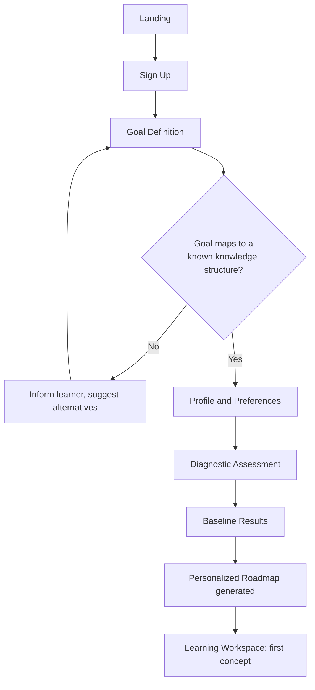
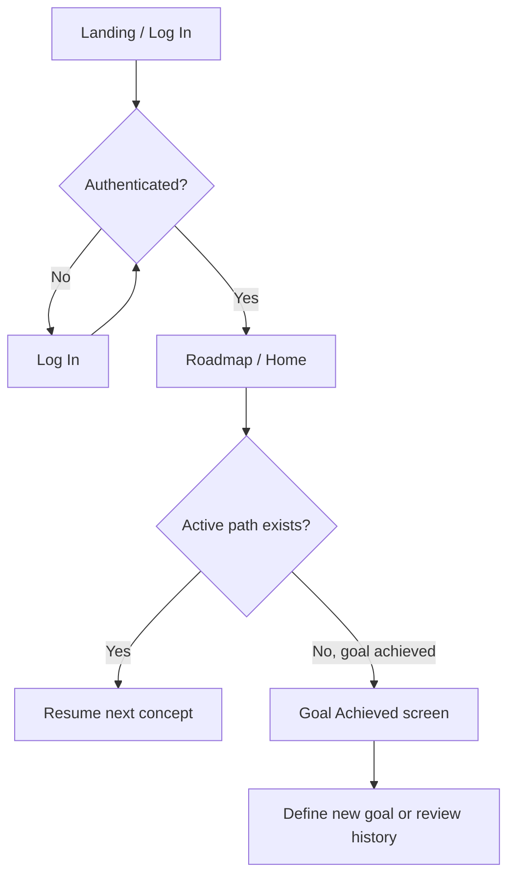
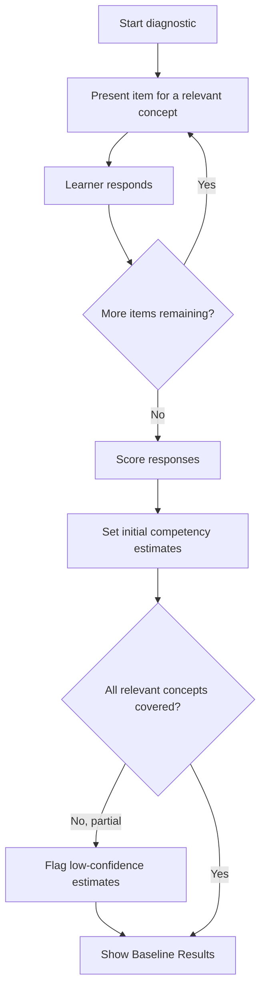
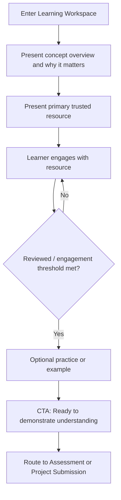
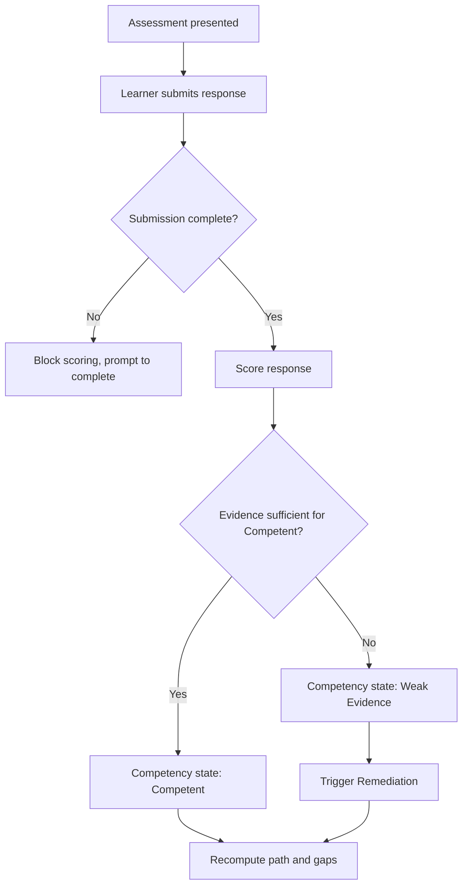
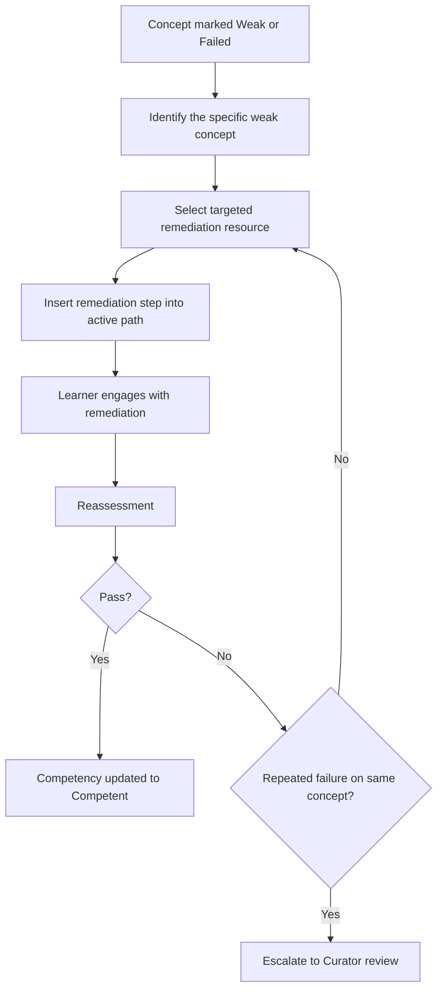
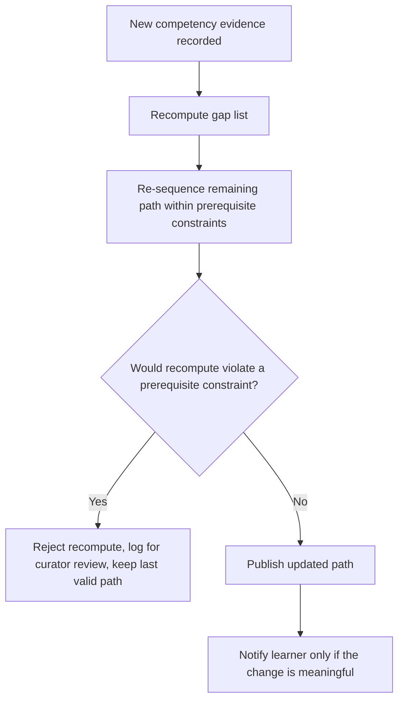

# UX / Information Architecture Design
## AI-Powered Personalized Learning Platform

*Built strictly from the approved Product Blueprint and SRS. No business-model, backend, or database decisions are made here.*

---

## 1. Page Inventory

**MVP page count: 18** (14 learner-facing, 4 curator/administrator-facing).

Deliberately *not* separate pages, and why: **Remediation** (surfaces inline inside Learning Workspace/Roadmap as a highlighted state, not a destination — remediation is a state of the path, not a new place); **Explainability "Why am I learning this?"** (a contextual panel launched from Roadmap/Learning Workspace, since it explains a decision already on screen); **Notifications** (a header dropdown, not a page, to keep the loop tight); **Feedback** (an inline widget on resource/decision cards); **Resource Explorer / browse-all-resources** (deliberately excluded — the product principle is "we choose the best-fit resource for you," not "browse a catalog"; an alternate-resource option is offered *inside* Learning Workspace instead, per Section 6).

### 1.1 Learner-Facing Pages

**P-01 Landing**
- Purpose: Explain the product and value proposition to a Prospective Learner; convert to sign-up.
- Role: Prospective Learner (Guest)
- Primary action: Start / Sign Up
- Secondary actions: Log In, learn more (value prop detail)
- Data displayed: Static product/value content
- Inputs: None (or a lightweight goal-preview field, optional)
- Navigation: → Sign Up, → Log In
- Success state: Guest proceeds to Sign Up
- Error state: N/A (static page); failed navigation shows standard error toast

**P-02 Sign Up**
- Purpose: Create a Learner account.
- Role: Prospective Learner
- Primary action: Submit registration
- Secondary actions: Switch to Log In
- Data displayed: Form, terms reference
- Inputs: Email, password (or SSO), consent
- Navigation: → Goal Definition (on success)
- Success state: Account created, session established, routed to onboarding
- Error state: Duplicate account, weak password, validation errors shown inline; no confirmation of whether an email already exists beyond a generic message (security)

**P-03 Log In**
- Purpose: Authenticate a returning Learner (also entry for Curator/Admin, routed differently post-auth).
- Role: Learner / Curator / Administrator
- Primary action: Submit credentials
- Secondary actions: Forgot password, switch to Sign Up
- Data displayed: Form
- Inputs: Email/credential, password
- Navigation: → Roadmap/Home (Learner) or → Curator/Admin console (per role)
- Success state: Authenticated, routed by role
- Error state: Invalid credentials — generic error, no field-specific leakage

**P-04 Goal Definition**
- Purpose: Capture the learner's goal and map it to a knowledge structure.
- Role: Learner
- Primary action: Submit goal
- Secondary actions: Browse example goals (if supported), edit goal later
- Data displayed: Goal input field, example goals/supported domains
- Inputs: Free-text or structured goal selection
- Navigation: → Profile & Preferences (on success) / stays on page with guidance (if unmatched)
- Success state: Goal mapped to a valid knowledge structure
- Error state: Goal unsupported — learner is told plainly, offered closest supported alternatives; goal is flagged, not silently guessed at

**P-05 Profile & Preferences (Onboarding)**
- Purpose: Capture constraints, format preferences, and declared prior experience.
- Role: Learner
- Primary action: Save and continue
- Secondary actions: Skip optional fields
- Data displayed: Form pre-filled with any known defaults
- Inputs: Time availability, preferred resource format, prior experience level
- Navigation: → Diagnostic Assessment
- Success state: Profile saved, marked onboarding-ready
- Error state: Missing required fields blocked with inline guidance; missing optional fields degrade gracefully (defaults applied, not blocked)

**P-06 Diagnostic Assessment**
- Purpose: Establish baseline competency across concepts relevant to the goal.
- Role: Learner
- Primary action: Submit diagnostic responses
- Secondary actions: Save/resume later (if long)
- Data displayed: One diagnostic item at a time, progress indicator
- Inputs: Learner responses per item
- Navigation: → Baseline Results
- Success state: All items answered, estimates computed
- Error state: Incomplete diagnostic — partial/low-confidence estimates clearly labeled as such, learner can resume

**P-07 Baseline Results / Starting Point**
- Purpose: Show the learner what the diagnostic revealed before generating the full roadmap — a trust-building checkpoint, not just a silent transition.
- Role: Learner
- Primary action: Generate my roadmap
- Secondary actions: Review individual concept estimates
- Data displayed: Per-concept initial competency estimate, overall gap summary
- Inputs: None (confirmation only)
- Navigation: → Personalized Roadmap
- Success state: Learner confirms and roadmap is generated
- Error state: No qualifying resource for a required concept — gap flagged transparently here rather than surfacing later unexplained

**P-08 Personalized Roadmap (Home)**
- Purpose: The learner's home base — visualizes the full path, current position, and next step. Doubles as the returning-learner landing page.
- Role: Learner
- Primary action: Continue (go to next concept)
- Secondary actions: View a specific concept's status, ask "why this concept," view alternate concepts branches if any
- Data displayed: Ordered concept sequence with state (locked/available/in-progress/weak/competent), current position marker, goal name
- Inputs: None (selection only)
- Navigation: → Learning Workspace, → Progress & Competency Dashboard, → Profile & Settings
- Success state: Learner clearly sees where they are and what's next
- Error state: Path recompute conflict — shows last valid path with a non-blocking notice that an update is pending curator review

**P-09 Learning Workspace**
- Purpose: Deliver a single concept's explanation, resource, and practice; the core "learning" screen (see Section 6 for full design).
- Role: Learner
- Primary action: "I'm ready to demonstrate understanding" → go to Assessment
- Secondary actions: View alternate resource, ask "why this resource," mark reviewed, give feedback
- Data displayed: Concept name, why-it-matters framing, primary resource, optional practice/example, prerequisite state
- Inputs: Engagement confirmation, feedback (optional)
- Navigation: → Assessment (or → Project Submission if concept requires applied evidence)
- Success state: Learner engages and proceeds to assessment
- Error state: Resource unreachable — fallback resource shown automatically, or a clear "temporarily unavailable" state with curator flag already triggered silently

**P-10 Assessment (Quiz/Scenario)**
- Purpose: Elicit evidence of understanding for the current concept.
- Role: Learner
- Primary action: Submit assessment
- Secondary actions: None (assessments are focused, single-task screens by design)
- Data displayed: Assessment items, progress within the assessment
- Inputs: Learner responses
- Navigation: → Competency result (inline) → Roadmap (next step) or Remediation state in Learning Workspace
- Success state: Result recorded, competency updated
- Error state: Incomplete submission — blocked from scoring, learner prompted to complete or explicitly exit (exit does not generate a competency-advancing result)

**P-11 Project Submission**
- Purpose: Collect applied/practical evidence for concepts that require it.
- Role: Learner
- Primary action: Submit project artifact/response
- Secondary actions: Save draft, view submission guidelines
- Data displayed: Submission requirements, prior attempt history if any
- Inputs: Artifact upload / structured response
- Navigation: → Confirmation state → Roadmap (result may be async if curator review needed)
- Success state: Submission recorded and routed to evaluation
- Error state: Evaluation inconclusive — learner is told the review is pending human curator input, not left with an ambiguous silent state

**P-12 Progress & Competency Dashboard**
- Purpose: Show goal-level progress and per-concept competency detail in one place (two tabs: "Progress" and "Competency Detail").
- Role: Learner
- Primary action: Drill into a specific concept's evidence history
- Secondary actions: Switch tabs, export/share (later scope)
- Data displayed: Goal completion percentage (competency-based, never content-consumption-based), per-concept state, evidence history and dates
- Inputs: None (view/filter only)
- Navigation: → Learning Workspace (jump to a specific concept), → Roadmap
- Success state: Learner has an accurate, evidence-grounded view of their standing
- Error state: Data temporarily unavailable — explicit "can't load right now" state, never a silently stale or fabricated number

**P-13 Goal Achieved**
- Purpose: Confirm and celebrate goal completion with full evidence backing; prompt next step.
- Role: Learner
- Primary action: Define a new goal / explore next goal
- Secondary actions: Review full competency summary, share (later scope)
- Data displayed: Full list of concepts and their evidence-backed Competent status
- Inputs: None
- Navigation: → Goal Definition (new goal) or → Progress & Competency Dashboard
- Success state: Learner sees a fully evidence-backed completion summary
- Error state: N/A — this page is only reachable once full coverage is verified (UC-13); it cannot show a false-positive completion

**P-14 Profile & Settings**
- Purpose: Manage account, preferences, and notification settings.
- Role: Learner
- Primary action: Save changes
- Secondary actions: Update goal-related preferences, manage notification channels, log out
- Data displayed: Current account/profile/preference/notification settings
- Inputs: Edited fields
- Navigation: Accessible from persistent nav on any learner page
- Success state: Changes saved and reflected immediately
- Error state: Invalid input blocked inline; save failure shows retry option without discarding entered data

### 1.2 Curator/Administrator-Facing Pages

**P-15 Curator — Knowledge Structure Manager**
- Purpose: Author and maintain concepts, prerequisites, and sequencing constraints per domain.
- Role: Content Curator
- Primary action: Create/edit/publish a knowledge structure version
- Secondary actions: Validate structure (check for circular/invalid dependencies), view version history
- Data displayed: Concept graph, prerequisite relationships, structure version state (draft/published)
- Inputs: Concept definitions, prerequisite mappings
- Navigation: → Resource Curation Queue (to attach resources to new concepts)
- Success state: Structure passes validation and publishes
- Error state: Invalid structure (e.g., circular dependency) rejected with a diagnostic pointing to the specific conflicting concepts

**P-16 Curator — Resource Curation Queue**
- Purpose: Vet, approve, retire, or flag resources per concept.
- Role: Content Curator
- Primary action: Approve/publish or retire a resource
- Secondary actions: Review staleness/quality flags, view aggregated learner feedback for a resource
- Data displayed: Candidate resources with provenance metadata, flagged resources needing re-review, aggregated feedback signals
- Inputs: Review decision, provenance metadata edits
- Navigation: → Knowledge Structure Manager (to confirm concept mapping)
- Success state: Only provenance-complete, vetted resources reach the active catalog
- Error state: Candidate missing required provenance cannot be published; blocked with a specific missing-field notice

**P-17 Admin — User & Role Management**
- Purpose: Manage accounts and role assignments (Learner/Curator/Administrator).
- Role: Platform Administrator
- Primary action: Assign/change a role or account status
- Secondary actions: Search/filter accounts, view account activity summary
- Data displayed: Account list, current roles/status
- Inputs: Role/status changes
- Navigation: → Audit Log (to confirm a change was recorded)
- Success state: Change applied and logged
- Error state: Unauthorized or malformed change rejected with a specific reason

**P-18 Admin — Audit Log**
- Purpose: Review attributable history of curator/admin actions and competency-affecting system events.
- Role: Platform Administrator
- Primary action: Filter/search the log
- Secondary actions: Export (later scope)
- Data displayed: Actor, action, target entity, timestamp
- Inputs: Filter criteria
- Navigation: Accessible from Admin console
- Success state: Relevant entries found and displayed
- Error state: No results state clearly distinguished from a load failure state

---

## 2. Navigation Map

**Learner persistent navigation (left sidebar or top bar, collapses on mobile — see Section "Responsive UX"):**
- Roadmap (Home)
- Progress & Competency
- Profile & Settings
- Header: notification bell (dropdown, not a page), account menu

**Contextual navigation (appears only where relevant, not persistent):**
- "Why am I learning this?" — panel launched from Roadmap and Learning Workspace
- "Give feedback" — inline affordance on resource cards and path decisions
- "Try an alternate resource" — inline affordance inside Learning Workspace only

**Curator/Administrator persistent navigation (separate console, role-gated):**
- Knowledge Structures
- Resource Queue
- Users & Roles (Admin only)
- Audit Log (Admin only)

**Cross-cutting rule:** Learner and Curator/Admin navigation are never merged in the same shell — a Curator who is also evaluating the product as a learner uses a distinct account context, preventing role confusion in the UI.

---

## 3. Complete User Flow (End-to-End)

```
Entry (Landing)
  → Sign Up / Log In
  → Goal Definition
      ⤷ [Goal unsupported] → inform learner, suggest closest supported goals → retry
  → Profile & Preferences
  → Diagnostic Assessment
      ⤷ [Incomplete] → resumable partial state, low-confidence flag
  → Baseline Results (Skill Gaps shown)
  → Personalized Roadmap generated
      ⤷ [Missing resource for a required concept] → gap flagged transparently, curator notified, learner told this concept is pending
  → Learning Workspace (current concept)
  → Resource engagement
  → Assessment (or Project Submission if applied evidence required)
      ⤷ [Incomplete submission] → blocked from scoring, resume prompt
  → Evidence recorded → Competency updated
      ⤷ [Sufficient evidence] → Concept marked Competent → path advances to next concept
      ⤷ [Insufficient evidence] → Remediation triggered → targeted resource → reassessment
            ⤷ [Repeated failure] → escalated to Curator review, learner informed plainly
  → Repeat (next concept, respecting prerequisite order)
  → All required concepts Competent → Goal Achieved
      ⤷ Learner may define a new goal (returns to Goal Definition) or review full competency history

Returning-user path (any session after the first):
  Log In → Roadmap (Home) → resume at current position
      ⤷ [Goal already achieved, no new goal set] → Goal Achieved / "define a new goal" prompt shown instead of an empty roadmap
```

---

## 4. Flowcharts

### A. First-Time Learner



### B. Returning Learner



### C. Diagnostic Process



### D. Learning a Concept



### E. Assessment and Competency Update



### F. Remediation



### G. Adaptive Next-Step Decision



---

## 5. UI Wireframes (Text)

**P-01 Landing**
```
HEADER    [Logo]                                   [Log In] [Sign Up]
MAIN      Hero: value proposition headline + one-line differentiator
          [Start my goal] (primary CTA)
          Supporting section: how it works (3-4 steps, not a feature wall)
FOOTER    Minimal links
```

**P-04 Goal Definition**
```
HEADER    [Logo]                                    [Account menu]
MAIN      "What's your goal?"
          [Goal input field]
          Supported-domain hints / example goals (assistive, not a full catalog)
          [Continue] (primary CTA)
ERROR     Inline banner if goal unsupported, with 2-3 closest alternatives
```

**P-06 Diagnostic Assessment**
```
HEADER    Progress bar (item X of N)
MAIN      Single diagnostic item, centered, one question at a time
          [Response input]
          [Next] (primary CTA)
FOOTER    [Save & exit] (secondary, resumable)
```

**P-07 Baseline Results**
```
HEADER    "Here's where you're starting from"
MAIN      Per-concept estimate list (compact, scannable — not a data dump)
          Overall gap summary sentence
RIGHT     [Generate my roadmap] (primary CTA, sticky)
```

**P-08 Personalized Roadmap (Home)**
```
HEADER    Goal name                                 [notif bell] [account]
SIDEBAR   Roadmap | Progress & Competency | Profile & Settings
MAIN      Vertical/branching path visualization:
            ● Concept 1 (Competent)
            ● Concept 2 (Competent)
            ▶ Concept 3 (In Progress) ← current position marker
            ○ Concept 4 (Locked — prerequisite pending)
            ⚠ Concept 5 (Weak Evidence — remediation inserted)
RIGHT     "Why this is next" link | [Continue] (primary CTA, jumps to current concept)
```

**P-09 Learning Workspace**
```
HEADER    Concept name                    Prerequisite state indicator
MAIN      Why this matters (1-2 sentences)
          [Primary trusted resource — embedded or linked, single choice]
          (collapsed) Practice / worked example — expand on demand
RIGHT     [Mark reviewed] → [I'm ready to demonstrate understanding] (primary CTA)
          "Try a different resource" (secondary, low-emphasis)
          "Why this resource" (tertiary link)
FOOTER    Feedback affordance (small, non-intrusive)
```

**P-10 Assessment**
```
HEADER    Concept name — Assessment            Progress within assessment
MAIN      Single-focus item area (quiz item or scenario prompt)
          [Response input]
          [Submit] (primary CTA) — no secondary distractions on this screen
```

**P-11 Project Submission**
```
HEADER    Concept name — Project
MAIN      Requirements summary (concise)
          [Submission input / upload]
          Prior attempt note, if any
RIGHT     [Submit] (primary CTA)   [Save draft] (secondary)
```

**P-12 Progress & Competency Dashboard**
```
HEADER    [Progress] [Competency Detail]  ← tabs
MAIN (Progress tab)
   Goal completion (competency-based %) — large, single number
   Milestone timeline (concepts reached Competent, in order)
MAIN (Competency Detail tab)
   Per-concept state table: state, last evidence date, evidence type
   [Drill in] per row → jumps to that concept's evidence history
```

**P-13 Goal Achieved**
```
HEADER    "Goal achieved" confirmation
MAIN      Full list of concepts with evidence-backed Competent status
          Short evidence-backed summary statement
RIGHT     [Define a new goal] (primary CTA)   [Review full history] (secondary)
```

**P-14 Profile & Settings**
```
HEADER    Profile & Settings
MAIN      Sectioned form: Account | Preferences | Notifications
RIGHT     [Save changes] (primary CTA, sticky)
```

**P-15 Curator — Knowledge Structure Manager**
```
HEADER    Domain selector                          [Publish] [Save draft]
MAIN      Concept graph editor (nodes = concepts, edges = prerequisites)
RIGHT     Selected concept detail panel: name, definition, prerequisites
FOOTER    Validation status banner (e.g., "circular dependency detected between X and Y")
```

**P-16 Curator — Resource Curation Queue**
```
HEADER    Filters: domain, concept, status (candidate / flagged / published)
MAIN      Queue list: resource, provenance summary, status
RIGHT     Selected resource detail: full provenance, freshness status, feedback signal
          [Approve] [Retire] [Request more info] (primary actions on selected item)
```

**P-17 Admin — User & Role Management**
```
HEADER    Search/filter accounts
MAIN      Account table: name/email, role, status
RIGHT     Selected account detail: [Change role] [Change status] (primary actions)
```

**P-18 Admin — Audit Log**
```
HEADER    Filters: actor, action type, date range
MAIN      Log table: actor, action, target entity, timestamp
```

---

## 6. Learning Experience Design (Learning Workspace, Detailed)

The Learning Workspace is the highest-stakes screen in the product — it is where the "not another chatbot, not another course platform" promise is either kept or broken. Design goal: **one primary resource, one primary next step, everything else optional and out of the way.**

**Progressive disclosure order (top to bottom):**
1. **Orientation strip** — concept name + one-sentence "why this matters for your goal" (grounds the concept in the learner's actual goal, sourced from the real path decision, not generic copy).
2. **Primary resource** — exactly one best-fit trusted resource, presented natively (embedded video/article/interactive) where possible rather than just a link-out. This is the center of the screen. No competing list of alternatives shown by default.
3. **Optional practice/example** — collapsed by default; a worked example or light practice item the learner can expand if they want reinforcement before assessment. Not required to proceed.
4. **Single primary CTA** — "I'm ready to demonstrate understanding," enabled once a basic engagement signal is met (e.g., resource opened/marked reviewed). This engagement signal gates *access to* the assessment; it is never itself recorded as competency evidence (competency comes only from the assessment/project result that follows).
5. **Low-emphasis secondary actions** — "try a different resource" and "why this resource," present but visually subordinate, so a learner who wants control has it without it competing with the primary path.
6. **Assessment/Scenario/Project** happens on its own dedicated screen (P-10/P-11), not inline — this keeps "learning" and "evidence" cognitively distinct, which matters for the product's core promise that evidence is separate from consumption.
7. **Progress and competency evidence** are deliberately *not* shown inline on the Learning Workspace beyond the current concept's own prerequisite state — full progress lives on its own dashboard (P-12) so the learning screen stays focused on one concept at a time rather than becoming a dashboard itself.

**What is explicitly avoided:** a wall of resource options (contradicts "we curate, you don't have to"), a visible content-consumption progress bar framed as competency (contradicts BR-06), and stacking quiz + video + scenario + project on one scrolling page (cognitive overload).

---

## 7. Component Hierarchy (Design System)

**Navigation model:** Persistent left sidebar (desktop) with three top-level learner destinations (Roadmap, Progress & Competency, Profile & Settings); everything else is contextual (panels, modals, inline affordances), not additional nav items — keeping the primary nav intentionally small reinforces the "we guide you" principle.

**Information hierarchy:** Goal → current concept → resource/action always outranks metadata. On any given screen, exactly one primary CTA should be visually dominant; secondary/tertiary actions are visually subordinate (smaller, lower-contrast, or text-links rather than buttons).

**Typography hierarchy:** 
- H1 — page/screen purpose (e.g., concept name, "Goal achieved")
- H2 — section labels (e.g., "Why this matters," "Competency Detail")
- Body — resource framing, explanations
- Caption/meta — dates, provenance, status labels (visually de-emphasized, never competing with primary content)

**Component categories:**
- Path/roadmap node (states: locked, available, in-progress, weak-evidence, competent)
- Resource card (single-resource presentation, with provenance/freshness meta available on demand, not by default)
- Assessment item (single-focus, one question/scenario per view)
- Competency badge/state chip (see status indicators below)
- Explanation panel ("why am I learning this")
- Feedback affordance (lightweight rating/flag, inline)
- Notification item (event-linked, dismissible)

**Status indicators (skill/competency states):** Not Started (neutral/gray) · In Progress (active/blue) · Weak Evidence (amber, paired with a remediation affordance, never framed as failure/red) · Competent (affirmative/green, evidence-linked).

**Locked/unlocked states:** A locked concept is visually muted with its blocking prerequisite named directly ("Unlocks after: X"), never a bare padlock with no explanation — this reinforces explainability as a system-wide pattern, not just a modal feature.

**Progress states:** Progress is always expressed as competency achieved (e.g., "3 of 7 concepts competent"), never as content consumed — this is enforced as a component-level rule so no screen can accidentally introduce a completion-percentage metric.

**Accessibility principles:** Sufficient color contrast for all status indicators (state must also be conveyed by icon/label, not color alone — important given amber/green/gray status chips); full keyboard navigability for the core loop (goal → diagnostic → roadmap → learning → assessment); readable default text sizing; assessment screens avoid strict timers unless pedagogically required, to avoid disadvantaging learners who need more time.

---

## 8. UX Rules

- Exactly one primary CTA per screen in the core loop; secondary actions never visually compete with it.
- Competency-affecting language ("Competent," "Weak Evidence") is used consistently everywhere it appears — never re-labeled per screen, so learners build a stable mental model.
- No screen frames content-consumption ("% watched," "time spent") as progress or competency.
- Every locked or gated state names its unlocking condition in plain language.
- Every automated decision the learner might question (next concept, resource choice) must be explainable from that same screen via the "why" affordance — never a dead end.
- Assessment and Project screens are single-focus (no competing navigation or content) to protect the integrity and seriousness of evidence collection.
- Remediation is presented as "here's what to focus on next," never as a penalty screen or failure state — tone matters for retention (per blueprint risk: "evidence gates feel like exam pressure").
- Curator/Admin tooling is never exposed inside the learner shell, and vice versa.

### Responsive UX

- **Desktop:** Full persistent sidebar navigation; roadmap shown as a spacious vertical/branching path; Learning Workspace uses a two-column layout (resource main column, actions/secondary info in a slim right rail).
- **Tablet:** Sidebar collapses to an icon rail or top tab bar; roadmap and dashboard remain visually similar to desktop but single-column where needed; right-rail content in Learning Workspace moves below the primary resource.
- **Mobile:** Bottom navigation bar replaces the sidebar (Roadmap / Progress / Profile); roadmap becomes a scrollable vertical list rather than a branching visual; Learning Workspace becomes fully single-column and single-task per screen (e.g., "why this matters" and the resource may be separate swipeable/scrollable sections rather than simultaneous); assessments and project submission remain single-focus exactly as on desktop, since that constraint is about cognitive load, not screen size.

---

## 9. Accessibility Rules

- All status/state communication (competency, lock state, progress) uses icon + text label, not color alone.
- Minimum contrast ratios met for all text and status indicators.
- All core-loop interactions (goal input, diagnostic response, resource engagement confirmation, assessment submission) are fully operable by keyboard and screen reader.
- Form errors (goal unsupported, incomplete diagnostic, invalid submission) are announced programmatically, not conveyed by color/icon alone.
- No essential information conveyed only through a tooltip or hover-only interaction (must also be reachable via focus/tap).
- Timed elements avoided by default; if a future assessment format requires timing, it must be disclosed to the learner in advance and configurable where pedagogically reasonable.

---

## 10. Critical UX Decisions (and Why)

1. **Roadmap doubles as Home for returning learners** rather than a separate dashboard — reduces page count and reinforces "the path is the product," not a generic dashboard.
2. **Progress and Competency Detail are one page with two tabs**, not two separate pages — they're two views of the same underlying evidence, and splitting them risked implying they were different kinds of truth.
3. **No Resource Explorer / browse-all-resources page** — deliberately contradicts the "browse everything yourself" pattern of YouTube/Coursera/Google that the blueprint positions against; an alternate-resource option exists but stays subordinate, inside Learning Workspace.
4. **Remediation and Explainability are states/panels, not destinations** — keeps the primary navigation small and keeps remediation framed as part of the same path, not a separate punitive area.
5. **Assessment and Project Submission are isolated, single-focus screens**, deliberately separated from the Learning Workspace — protects the "evidence over self-report" principle by making evidence-collection feel distinct and consequential, not just another scroll of the same page.
6. **Curator/Admin tooling lives in a fully separate navigational shell** — prevents any blending of "content management" affordances into the learner experience, keeping trust in the curated path intact.
7. **Baseline Results is its own page**, not skipped straight to the roadmap — gives the learner a moment to see and trust *why* their path looks the way it does before committing to it, directly supporting the explainability principle from the blueprint.

---

*End of UX/IA design. This document is the authoritative UX reference for visual design and frontend implementation — no backend architecture, database schema, or infrastructure decisions are included.*
