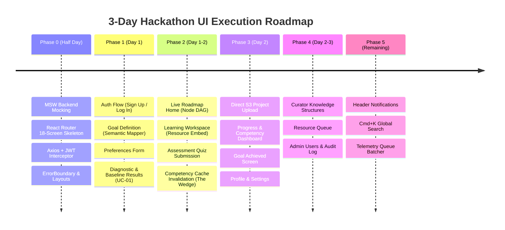

# Frontend API Integration & UI Feature Implementation Guide
## AI-Powered Personalized Learning Platform (React + JSX Edition)

> **SINGLE SOURCE OF TRUTH FOR FRONTEND DEVELOPMENT**
> This document defines the exact pure React (`.jsx` / `.js`) architecture, the 18-screen UI-to-API bindings, TanStack Query cache invalidation strategies, Mock Service Worker (MSW) setup, testing infrastructure, and hackathon build sequence.

---

## 1. Production-Ready React Folder Structure

```text
frontend/
├── public/                                # Static public assets
│   ├── favicon.ico
│   ├── brand/                             # Logos, branding icons
│   └── illustrations/                     # Mountain climb hero, trophy badge, empty states
│
├── tests/                                 # Automated Test Suites (Playwright & RTL)
│   ├── unit/                              # Hook logic, utility formatters, state reducers
│   ├── component/                         # React Testing Library + individual UI components
│   └── e2e/                               # Playwright core loop tests (UC-01 to UC-08)
│
├── src/
│   ├── assets/                            # Images, SVGs, icons imported into JSX
│   │   ├── icons/
│   │   └── images/
│   │
│   ├── pages/                             # All 18 UI Screens (Pure .jsx)
│   │   ├── public/
│   │   │   └── LandingPage.jsx            # [01] Landing Page
│   │   │
│   │   ├── auth/
│   │   │   ├── SignUpPage.jsx             # [02] Sign Up
│   │   │   ├── LoginPage.jsx              # [03] Log In
│   │   │   └── ForgotPasswordPage.jsx     # Forgot Password / Reset
│   │   │
│   │   ├── onboarding/
│   │   │   ├── GoalDefinitionPage.jsx     # [04] Goal Definition
│   │   │   ├── PreferencesPage.jsx        # [05] Profile & Preferences
│   │   │   ├── DiagnosticPage.jsx         # [06] Diagnostic Assessment
│   │   │   └── BaselineResultsPage.jsx    # [07] Baseline Results
│   │   │
│   │   ├── learner/
│   │   │   ├── RoadmapPage.jsx            # [08] Personalized Roadmap (Home)
│   │   │   ├── LearningWorkspacePage.jsx  # [09] Learning Workspace
│   │   │   ├── AssessmentPage.jsx         # [10] Assessment Quiz
│   │   │   ├── ProjectSubmissionPage.jsx  # [11] Project Submission
│   │   │   ├── ProgressPage.jsx           # [12] Progress & Competency Dashboard
│   │   │   ├── GoalAchievedPage.jsx       # [13] Goal Achieved Celebration
│   │   │   └── SettingsPage.jsx           # [14] Profile & Settings
│   │   │
│   │   ├── curator/
│   │   │   ├── KnowledgeStructurePage.jsx # [15] Knowledge Structure Manager
│   │   │   └── ResourceCurationPage.jsx   # [16] Resource Curation Queue
│   │   │
│   │   ├── admin/
│   │   │   ├── UserManagementPage.jsx     # [17] Admin - User & Role Management
│   │   │   └── AuditLogPage.jsx           # [18] Admin - Audit Log Explorer
│   │   │
│   │   └── NotFoundPage.jsx               # 404 Fallback Screen
│   │
│   ├── components/                        # Reusable UI Components (.jsx)
│   │   ├── layouts/                       # Persistent Navigation Shells
│   │   │   ├── LearnerLayout.jsx          # Shell with Learner Sidebar & Header
│   │   │   ├── CuratorLayout.jsx          # Shell for Curator Console
│   │   │   ├── AdminLayout.jsx            # Shell for Admin Console
│   │   │   ├── AuthLayout.jsx             # Minimalist Card Shell for Auth
│   │   │   ├── Header.jsx                 # Top bar with Notifications & Global Search
│   │   │   ├── Sidebar.jsx                # Responsive Collapsible Sidebar
│   │   │   └── ProtectedRoute.jsx         # Role-based route guard component
│   │   │
│   │   ├── roadmap/                       # Screen 08 Components
│   │   │   ├── RoadmapGraph.jsx           # Interactive vertical/DAG path
│   │   │   ├── NodeCard.jsx               # Node with Competent/In-Progress/Weak styling
│   │   │   ├── NodeDetailDrawer.jsx       # Right-rail concept summary
│   │   │   └── ExplainabilityModal.jsx    # "Why am I learning this?" modal
│   │   │
│   │   ├── workspace/                     # Screen 09 Components
│   │   │   ├── PrimaryResourceCard.jsx    # Video/Article embedded player
│   │   │   ├── AlternateResourceDrawer.jsx# "Try a different resource" drawer
│   │   │   ├── ResourceFeedback.jsx       # Inline 👍 / 👎 feedback widget
│   │   │   └── EngagementGate.jsx         # [Mark as Reviewed] CTA button
│   │   │
│   │   ├── assessment/                    # Screen 10 Components
│   │   │   ├── QuizCard.jsx               # Single question container
│   │   │   ├── OptionSelector.jsx         # Radio choice list
│   │   │   └── ResultBanner.jsx           # Grade result & competency update
│   │   │
│   │   ├── project/                       # Screen 11 Components
│   │   │   ├── ProjectDropzone.jsx        # S3 Drag & Drop file uploader
│   │   │   ├── UploadProgress.jsx         # File upload progress bar
│   │   │   └── AttemptHistory.jsx         # Prior attempts & review status
│   │   │
│   │   ├── progress/                      # Screen 12 Components
│   │   │   ├── CircularGauge.jsx          # Overall 64% progress gauge
│   │   │   ├── CompetencyTable.jsx        # Concept mastery list
│   │   │   └── EvidenceHistoryModal.jsx   # Drill-in evidence records
│   │   │
│   │   ├── curator/                       # Screens 15 & 16 Components
│   │   │   ├── GraphTreeEditor.jsx        # Concept hierarchy manager
│   │   │   ├── DependencyValidator.jsx    # Circular dependency checker
│   │   │   └── ResourceQueueCard.jsx      # Approve / Reject action card
│   │   │
│   │   ├── admin/                         # Screens 17 & 18 Components
│   │   │   ├── UserRoleModal.jsx          # Role/status editor modal
│   │   │   └── AuditFilterBar.jsx         # Date & Action filter controls
│   │   │
│   │   ├── cross-cutting/                 # Global UI Widgets
│   │   │   ├── NotificationsPopover.jsx   # Notification feed dropdown
│   │   │   ├── GlobalSearchModal.jsx      # Cmd+K search dialog
│   │   │   ├── FeedbackModal.jsx          # General platform feedback
│   │   │   └── StatusBadge.jsx            # Standardized status chip
│   │   │
│   │   └── common/                        # Atomic UI Primitives & Boundary
│   │       ├── ErrorBoundary.jsx          # Global & Route-level Crash Protection
│   │       ├── Button.jsx
│   │       ├── Input.jsx
│   │       ├── Card.jsx
│   │       ├── Modal.jsx
│   │       ├── Tabs.jsx
│   │       └── Toast.jsx
│   │
│   ├── hooks/                             # TanStack Query & Mutation Hooks (.js)
│   │   ├── useAuth.js                     # Login, signup, token, user profile
│   │   ├── useOnboarding.js               # Domain hints, goal mapping, preferences
│   │   ├── useDiagnostic.js               # Diagnostic runner & results
│   │   ├── useRoadmap.js                  # Roadmap nodes, node details, explainability
│   │   ├── useWorkspace.js                # Resource loading, review state
│   │   ├── useAssessment.js               # Quiz questions & grading submission
│   │   ├── useProjectUpload.js            # Presigned URL S3 PUT upload
│   │   ├── useProgress.js                 # Progress summary & competency records
│   │   ├── useCurator.js                  # Concept structures & curation queue
│   │   ├── useAdmin.js                    # User management & audit logs
│   │   ├── useNotifications.js            # Notification polling & read status
│   │   └── useTelemetry.js                # Batched background telemetry queue
│   │
│   ├── services/                          # API & External Integrations (.js)
│   │   ├── apiClient.js                   # Axios instance with JWT interceptors
│   │   ├── storageService.js              # S3 Presigned URL + PUT binary upload
│   │   └── telemetryBatcher.js            # In-memory queue + auto-flush timer
│   │
│   ├── context/                           # Global React State (.jsx)
│   │   ├── AuthContext.jsx                # User session, JWT tokens, logout
│   │   └── ToastContext.jsx               # Global popup toast notifications
│   │
│   ├── lib/                               # Core Libraries & Caching (.js)
│   │   └── queryClient.js                 # TanStack QueryClient with cache invalidation policies
│   │
│   ├── types/                             # Contract Layer & JSDoc Type Definitions (.d.ts)
│   │   └── api.d.ts                       # JSDoc / TS definitions mirroring OpenAPI schemas
│   │
│   ├── routes/                            # React Router Configuration (.jsx)
│   │   └── AppRoutes.jsx                  # All `<Route>` definitions matching the 18 screens
│   │
│   ├── styles/                            # Styling
│   │   ├── index.css                      # Global styles & layout reset
│   │   └── theme.css                      # CSS custom properties matching DB status enums
│   │
│   ├── utils/                             # Split Constants & Helpers (.js)
│   │   ├── endpoints.js                   # Master URL endpoints dictionary (only URLs)
│   │   ├── constants.js                   # Postgres CHECK-constraint enums (states, roles)
│   │   └── formatters.js                  # Date & duration formatting
│   │
│   ├── mocks/                             # Standalone Development (MSW)
│   │   ├── browser.js                     # MSW Worker setup for browser
│   │   ├── handlers.js                    # Mock routes for all endpoints
│   │   └── mockData.js                    # Static fixture objects for fast iteration
│   │
│   ├── App.jsx                            # Root component with QueryClientProvider & ErrorBoundary
│   └── main.jsx                           # React DOM entry point (boots MSW in dev)
│
├── .env                                   # VITE_API_BASE_URL=http://localhost:8080/api/v1
├── package.json
└── vite.config.js
```

---

## 2. Master Screen-to-API Binding Matrix (All 18 Screens)

| Screen # | Screen Name | Route Path | Triggering UI Element | Endpoint Constant (`endpoints.js`) | HTTP & URL | Query Cache Keys Affected |
|:---:|:---|:---|:---|:---|:---|:---|
| **01** | Landing Page | `/` | Page Load<br/>`[Get Started]` | `ENDPOINTS.DOMAINS` | `GET /domains` | `['domains']` |
| **02** | Sign Up | `/signup` | `[Sign Up]` Submit | `ENDPOINTS.AUTH.SIGNUP` | `POST /auth/signup` | Invalidates `['auth', 'me']` |
| **03** | Log In | `/login` | `[Log In]` Submit | `ENDPOINTS.AUTH.LOGIN` | `POST /auth/login` | Invalidates `['auth', 'me']` |
| **04** | Goal Definition | `/onboarding/goal` | Domain Chips<br/>`[Continue]` CTA | `ENDPOINTS.GOALS.BASE`<br/>`ENDPOINTS.DOMAINS` | `POST /goals`<br/>`GET /domains` | Invalidates `['goals', 'current']` |
| **05** | Profile & Preferences | `/onboarding/preferences` | `[Continue]` CTA | `ENDPOINTS.PROFILE.PREFERENCES` | `PATCH /profile/preferences` | Invalidates `['profile']` |
| **06** | Diagnostic Assessment | `/diagnostic` | Session Start<br/>`[Next]` / `[Submit]` | `ENDPOINTS.DIAGNOSTIC.START`<br/>`ENDPOINTS.DIAGNOSTIC.ANSWER` | `POST /diagnostics/start`<br/>`POST /diagnostics/{id}/answer` | `['diagnostic', sessionId]` |
| **07** | Baseline Results | `/diagnostic/results` | Results Load<br/>`[Generate Roadmap]` | `ENDPOINTS.DIAGNOSTIC.RESULTS`<br/>`ENDPOINTS.ROADMAP.REGENERATE` | `GET /diagnostics/{id}/results`<br/>`POST /roadmap/regenerate` | Invalidates `['roadmap']` |
| **08** | Roadmap (Home) | `/roadmap` | Page Load<br/>`[Why this concept?]`<br/>`[Continue]` CTA | `ENDPOINTS.ROADMAP.BASE`<br/>`ENDPOINTS.ROADMAP.WHY_CONCEPT` | `GET /roadmap`<br/>`GET /roadmap/concepts/{id}/why` | `['roadmap']`<br/>`['roadmap', 'why', id]` |
| **09** | Learning Workspace | `/learn/:conceptId` | Workspace Load<br/>`[Mark Reviewed]`<br/>`[Why Resource]`<br/>`[Alternate]`<br/>`[Feedback]` | `ENDPOINTS.CONCEPTS.DETAIL`<br/>`ENDPOINTS.CONCEPTS.ENGAGEMENT`<br/>`ENDPOINTS.CONCEPTS.WHY_RESOURCE`<br/>`ENDPOINTS.CONCEPTS.ALTERNATE`<br/>`ENDPOINTS.RESOURCES.FEEDBACK` | `GET /concepts/{id}`<br/>`POST /concepts/{id}/engagement`<br/>`GET /concepts/{id}/resources/{rId}/why`<br/>`GET /concepts/{id}/resources/alternate`<br/>`POST /resources/{rId}/feedback` | `['concept', id]`<br/>`['concept', 'alternate', id]` |
| **10** | Assessment Quiz | `/assessment/:conceptId` | Quiz Load<br/>`[Submit Answer]` | `ENDPOINTS.CONCEPTS.ASSESSMENT`<br/>`ENDPOINTS.CONCEPTS.SUBMIT_ASSESSMENT` | `GET /concepts/{id}/assessment`<br/>`POST /concepts/{id}/assessment/submit` | Invalidates `['roadmap']`, `['progress']`, `['competency']` |
| **11** | Project Submission | `/project/:conceptId` | Project Load<br/>File Drop<br/>`[Submit]` | `ENDPOINTS.CONCEPTS.PROJECT`<br/>`ENDPOINTS.STORAGE.UPLOAD_URL`<br/>`ENDPOINTS.CONCEPTS.SUBMIT_PROJECT` | `GET /concepts/{id}/project`<br/>`POST /storage/upload-url`<br/>`POST /concepts/{id}/project/submit` | Invalidates `['roadmap']`, `['project', id]` |
| **12** | Progress & Competency | `/progress` | `[Progress]` Tab<br/>`[Competency]` Tab<br/>Drill-in Item | `ENDPOINTS.PROGRESS.SUMMARY`<br/>`ENDPOINTS.COMPETENCY.DETAIL`<br/>`ENDPOINTS.COMPETENCY.HISTORY` | `GET /progress/summary`<br/>`GET /competency/detail`<br/>`GET /competency/{id}/history` | `['progress']`<br/>`['competency', 'detail']`<br/>`['competency', 'history', id]` |
| **13** | Goal Achieved | `/goal-achieved` | Page Load<br/>`[Define New Goal]` | `ENDPOINTS.GOALS.COMPLETION_SUMMARY` | `GET /goals/current/completion-summary` | `['goal', 'completion']` |
| **14** | Profile & Settings | `/settings` | `[Save Settings]`<br/>`[Change Password]`<br/>`[Delete Account]` | `ENDPOINTS.PROFILE.SETTINGS`<br/>`ENDPOINTS.AUTH.CHANGE_PASSWORD`<br/>`ENDPOINTS.PROFILE.ACCOUNT` | `PATCH /profile/settings`<br/>`POST /auth/change-password`<br/>`DELETE /profile/account` | Invalidates `['profile']`, `['auth', 'me']` |
| **15** | Knowledge Structure | `/curator/structures` | Tree Graph Load<br/>`[Add/Update]`<br/>`[Validate]` | `ENDPOINTS.CURATOR.STRUCTURES`<br/>`ENDPOINTS.CURATOR.VALIDATE_STRUCTURE` | `GET /curator/knowledge-structures`<br/>`POST /curator/knowledge-structures`<br/>`POST /curator/knowledge-structures/validate` | `['curator', 'structures']` |
| **16** | Resource Curation | `/curator/resources` | Queue Load<br/>`[Approve/Reject]`<br/>`[Feedback Signals]` | `ENDPOINTS.CURATOR.RESOURCES`<br/>`ENDPOINTS.CURATOR.RESOURCE_FEEDBACK_SIGNALS` | `GET /curator/resources`<br/>`PATCH /curator/resources/{id}`<br/>`GET /curator/resources/{id}/feedback-signals` | `['curator', 'resources']` |
| **17** | Admin - Users | `/admin/users` | User Table Search<br/>`[Update Role]` | `ENDPOINTS.ADMIN.USERS` | `GET /admin/users?q={query}`<br/>`PATCH /admin/users/{id}` | `['admin', 'users']` |
| **18** | Admin - Audit Log | `/admin/audit` | Filters / Page Load | `ENDPOINTS.ADMIN.AUDIT_LOG` | `GET /admin/audit-log?action={a}&range={r}` | `['admin', 'audit']` |
| **CC** | Notifications | Header Popover | Bell Click<br/>`[Mark Read]` | `ENDPOINTS.NOTIFICATIONS.BASE` | `GET /notifications`<br/>`PATCH /notifications/{id}/read` | `['notifications']` |
| **CC** | Global Search | Modal `Cmd+K` | Search Input | `ENDPOINTS.SEARCH` | `GET /search?q={query}` | `['search', query]` |
| **CC** | Telemetry Stream | Background Queue | Timers / Actions | `ENDPOINTS.TELEMETRY.EVENTS` | `POST /telemetry/events` | None (Silent push) |

---

## 3. Dedicated Constants & Postgres Schema Alignment

### `src/utils/endpoints.js` (URLs Only)
```javascript
export const ENDPOINTS = {
  AUTH: {
    SIGNUP: '/auth/signup',
    LOGIN: '/auth/login',
    REFRESH: '/auth/refresh',
    LOGOUT: '/auth/logout',
    ME: '/auth/me',
    CHANGE_PASSWORD: '/auth/change-password',
  },
  DOMAINS: '/domains',
  GOALS: {
    BASE: '/goals',
    CURRENT: '/goals/current',
    COMPLETION_SUMMARY: '/goals/current/completion-summary',
  },
  PROFILE: {
    SETTINGS: '/profile/settings',
    PREFERENCES: '/profile/preferences',
    ACCOUNT: '/profile/account',
  },
  DIAGNOSTIC: {
    START: '/diagnostics/start',
    ANSWER: (sessionId) => `/diagnostics/${sessionId}/answer`,
    RESULTS: (sessionId) => `/diagnostics/${sessionId}/results`,
  },
  ROADMAP: {
    BASE: '/roadmap',
    WHY_CONCEPT: (id) => `/roadmap/concepts/${id}/why`,
    REGENERATE: '/roadmap/regenerate',
  },
  CONCEPTS: {
    DETAIL: (id) => `/concepts/${id}`,
    ALTERNATE: (id) => `/concepts/${id}/resources/alternate`,
    WHY_RESOURCE: (id, resId) => `/concepts/${id}/resources/${resId}/why`,
    ENGAGEMENT: (id) => `/concepts/${id}/engagement`,
    ASSESSMENT: (id) => `/concepts/${id}/assessment`,
    SUBMIT_ASSESSMENT: (id) => `/concepts/${id}/assessment/submit`,
    PROJECT: (id) => `/concepts/${id}/project`,
    SUBMIT_PROJECT: (id) => `/concepts/${id}/project/submit`,
    PROJECT_STATUS: (id) => `/concepts/${id}/project/status`,
  },
  RESOURCES: {
    FEEDBACK: (id) => `/resources/${id}/feedback`,
  },
  PROGRESS: {
    SUMMARY: '/progress/summary',
  },
  COMPETENCY: {
    DETAIL: '/competency/detail',
    HISTORY: (conceptId) => `/competency/${conceptId}/history`,
  },
  CURATOR: {
    STRUCTURES: '/curator/knowledge-structures',
    VALIDATE_STRUCTURE: '/curator/knowledge-structures/validate',
    RESOURCES: '/curator/resources',
    RESOURCE_DETAIL: (id) => `/curator/resources/${id}`,
    RESOURCE_FEEDBACK_SIGNALS: (id) => `/curator/resources/${id}/feedback-signals`,
  },
  ADMIN: {
    USERS: '/admin/users',
    USER_DETAIL: (id) => `/admin/users/${id}`,
    AUDIT_LOG: '/admin/audit-log',
  },
  STORAGE: {
    UPLOAD_URL: '/storage/upload-url',
  },
  SEARCH: '/search',
  TELEMETRY: {
    EVENTS: '/telemetry/events',
  },
  HEALTH: '/health',
};
```

### `src/utils/constants.js` (Mirrors Postgres `CHECK` Constraints)
```javascript
// Mirrors Postgres: CHECK (state IN ('not_started', 'in_progress', 'weak_evidence', 'competent'))
export const NODE_STATES = {
  NOT_STARTED: 'not_started',
  IN_PROGRESS: 'in_progress',
  WEAK_EVIDENCE: 'weak_evidence',
  COMPETENT: 'competent',
};

// Mirrors Postgres: CHECK (role IN ('learner', 'curator', 'admin'))
export const USER_ROLES = {
  LEARNER: 'learner',
  CURATOR: 'curator',
  ADMIN: 'admin',
};

// Status Colors & Visual Configuration
export const NODE_CONFIG = {
  [NODE_STATES.COMPETENT]: {
    label: 'Competent',
    badgeClass: 'bg-emerald-100 text-emerald-800 border-emerald-300',
    colorHex: '#10B981',
    icon: 'CheckCircle',
  },
  [NODE_STATES.IN_PROGRESS]: {
    label: 'In Progress',
    badgeClass: 'bg-blue-100 text-blue-800 border-blue-300',
    colorHex: '#2563EB',
    icon: 'PlayCircle',
  },
  [NODE_STATES.WEAK_EVIDENCE]: {
    label: 'Weak Evidence',
    badgeClass: 'bg-amber-100 text-amber-800 border-amber-300',
    colorHex: '#F59E0B',
    icon: 'AlertTriangle',
  },
  [NODE_STATES.NOT_STARTED]: {
    label: 'Locked',
    badgeClass: 'bg-slate-100 text-slate-600 border-slate-300',
    colorHex: '#94A3B8',
    icon: 'Lock',
  },
};
```

---

## 4. TanStack Query Cache & Error Boundary Setup

### `src/lib/queryClient.js`
```javascript
import { QueryClient } from '@tanstack/react-query';

export const queryClient = new QueryClient({
  defaultOptions: {
    queries: {
      staleTime: 1000 * 60 * 5, // 5 minutes stale time
      cacheTime: 1000 * 60 * 30, // 30 minutes in memory
      refetchOnWindowFocus: false,
      retry: (failureCount, error) => {
        // Do not retry 401/403/404 errors
        if (error?.response?.status >= 400 && error?.response?.status <= 404) return false;
        return failureCount < 2;
      },
    },
  },
});
```

### `src/components/common/ErrorBoundary.jsx`
```jsx
import React from 'react';

export class ErrorBoundary extends React.Component {
  constructor(props) {
    super(props);
    this.state = { hasError: false, error: null };
  }

  static getDerivedStateFromError(error) {
    return { hasError: true, error };
  }

  componentDidCatch(error, errorInfo) {
    console.error('ErrorBoundary caught an unhandled error:', error, errorInfo);
  }

  render() {
    if (this.state.hasError) {
      return (
        <div className="p-8 my-6 mx-auto max-w-lg bg-red-50 border border-red-200 rounded-xl text-center">
          <h2 className="text-xl font-bold text-red-900 mb-2">Something went wrong</h2>
          <p className="text-sm text-red-700 mb-4">
            {this.state.error?.message || 'An unexpected rendering error occurred.'}
          </p>
          <button
            onClick={() => window.location.reload()}
            className="px-4 py-2 bg-red-600 text-white rounded-lg font-medium hover:bg-red-700 transition"
          >
            Reload Page
          </button>
        </div>
      );
    }
    return this.props.children;
  }
}
```

---

## 5. Hackathon Phased Build Sequence



### Phase Breakdown:
1. **Phase 0 — Skeleton & MSW Mocking (Half Day)**:
   - Bootstrap Vite + React + Tailwind + React Router + TanStack Query.
   - Setup MSW in `src/mocks/` with initial mock fixtures (`mockData.js`).
   - Stub all 18 route files with minimal layout containers.
2. **Phase 1 — Auth + Onboarding Loop (Day 1)**:
   - Complete `LandingPage` ➔ `SignUpPage` / `LoginPage` ➔ `GoalDefinitionPage` ➔ `PreferencesPage` ➔ `DiagnosticPage` ➔ `BaselineResultsPage`.
3. **Phase 2 — The Core Loop / "The Wedge" (Day 1–2, Demo Spine)**:
   - Build `RoadmapPage` (graph nodes) ➔ `LearningWorkspacePage` (resource & review CTA) ➔ `AssessmentPage` (quiz).
   - **Crucial Hook Trigger**: On `POST /concepts/{id}/assessment/submit`, invalidate `['roadmap']` query so the active node changes from `in_progress` to `competent` live on screen.
4. **Phase 3 — Supporting Features (Day 2)**:
   - S3 direct upload on `ProjectSubmissionPage`.
   - Circular radial progress & evidence table on `ProgressPage`.
   - `GoalAchievedPage` celebration and `SettingsPage`.
5. **Phase 4 — Curator & Admin Consoles (Day 2–3)**:
   - `KnowledgeStructurePage` concept tree, `ResourceCurationPage` queue, `UserManagementPage`, and `AuditLogPage`.
6. **Phase 5 — Polish & Telemetry (Remaining Time)**:
   - Notifications dropdown, global search dialog, and batched background telemetry.

---

## 6. Open-Source Knowledge Graph Compliance & Ingestion

Per **BR-02** of the SRS:
> *"Curriculum structure — concepts, prerequisites, and sequencing constraints — shall originate only from expert-authored/vetted knowledge structures. No component of the system may freely invent or alter prerequisite relationships."*

### ⚠️ Legal Compliance & Data Sourcing:
1. **roadmap.sh is OFF-LIMITS for scraping**: The content license strictly forbids scraping or republishing node structures outside their repository.
2. **OSSU (Open Source Society University)**: MIT-licensed and legal to ingest, transform, and redistribute with attribution.
3. **ESCO & ACM CCS**: Open European Commission / ACM taxonomies for skill classification.

### ETL & Curator Ingestion Rule:
* Auto-imported graphs are pushed via Go admin CLI/endpoint with `status = 'draft'`.
* **Zero unvetted data is ever published directly to learners**: A human curator must review, validate, and approve the structure in **Screen 15 (`/curator/structures`)** before the FastAPI gap analysis or roadmap generator can serve it.
